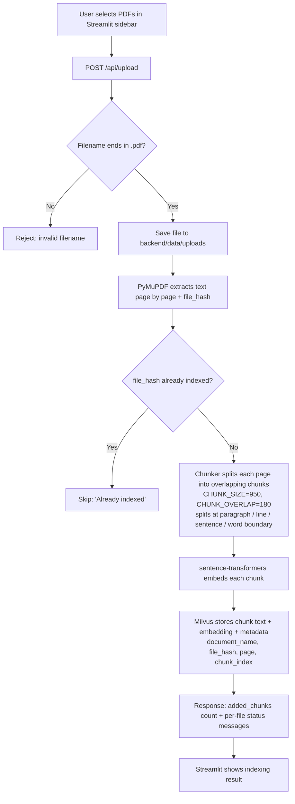
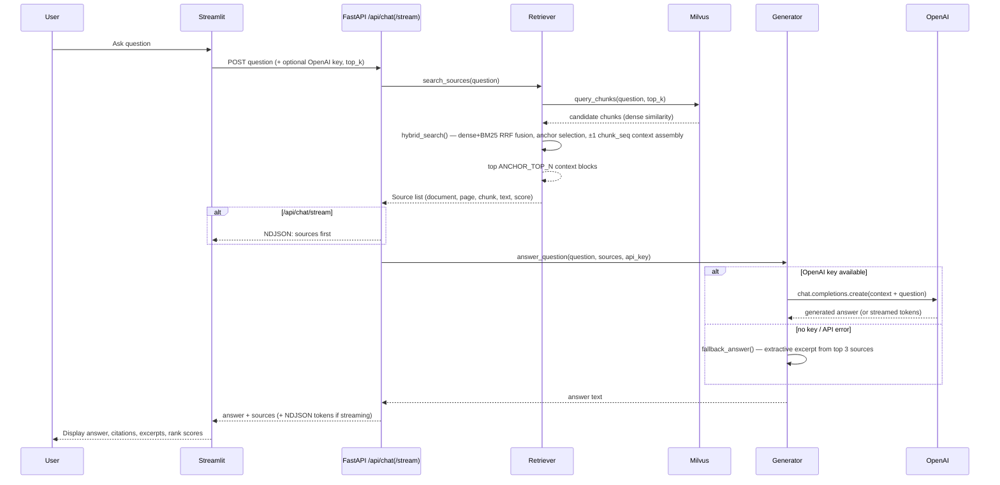
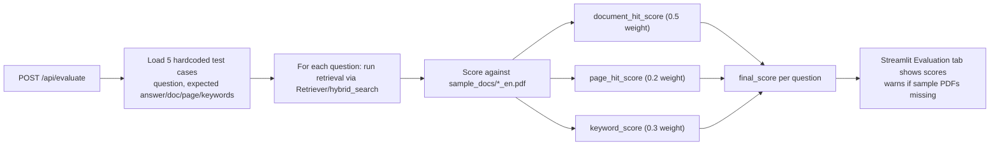

# Architecture — RAG Document Chat

## Overview

RAG Document Chat is a business-document Q&A app for uploaded PDFs (agreements,
manuals, handbooks, policies). A **FastAPI** backend extracts text from PDFs with
**PyMuPDF**, splits it into overlapping chunks, embeds chunks with
**sentence-transformers**, and stores them in a **Milvus** collection.
Chat queries run hybrid retrieval — dense (embedding) search and Milvus-native
BM25 full-text search, fused with Reciprocal Rank Fusion, expanded into
anchor-centered ±1 chunk_seq context blocks — and answers are generated with the
**OpenAI API** or, when no key is available, an extractive fallback built directly
from the retrieved chunks. A **Streamlit** frontend provides upload, chat
(streaming and non-streaming), document management, and a fixed 5-question
retrieval evaluation benchmark. The whole stack runs via Docker Compose.

## Component Architecture

```mermaid
%%{init: {"themeVariables": {"fontSize": "22px"}, "flowchart": {"fontSize": 22, "nodeSpacing": 45, "rankSpacing": 60}}}%%
graph TB
    subgraph Client
        UI[Streamlit Frontend<br/>frontend/app.py]
    end

    subgraph Backend["FastAPI Backend (backend/app)"]
        MAIN[main.py<br/>App + CORS + router registration]

        subgraph API["api/"]
            UPLOAD_EP["POST /api/upload"]
            CHAT_EP["POST /api/chat"]
            STREAM_EP["POST /api/chat/stream"]
            DOCS_EP["GET /api/documents/stats, list<br/>DELETE /api/documents/{hash}"]
            EVAL_EP["POST /api/evaluate"]
        end

        subgraph RAG["rag/ pipeline"]
            LOADER[pdf_loader.py<br/>PyMuPDF page extraction]
            CHUNKER[chunker.py<br/>overlapping chunk splitter]
            EMBED[embeddings.py<br/>sentence-transformers]
            VSTORE[vector_store.py<br/>Milvus client]
            RETRIEVER[retriever.py<br/>hybrid_search() adapter → Source]
            HYBRID[hybrid_search.py<br/>dense+BM25 RRF fusion + anchor/context assembly]
            GENERATOR[generator.py<br/>OpenAI call / extractive fallback]
            EVALUATOR[evaluator.py<br/>retrieval scoring]
            PROMPTS[prompts.py]
        end

        CONFIG[config.py<br/>env vars: CHUNK_SIZE, TOP_K, models, dirs]
        TESTCASES[data/test_cases.py<br/>5 hardcoded eval questions]
    end

    MILVUS[(Milvus<br/>MILVUS_HOST:MILVUS_PORT)]
    UPLOADS[(Uploaded PDFs<br/>backend/data/uploads)]
    OPENAI{{OpenAI API<br/>gpt-4o-mini}}

    UI -->|multipart PDF upload| UPLOAD_EP
    UI -->|question| CHAT_EP
    UI -->|question, NDJSON stream| STREAM_EP
    UI --> DOCS_EP
    UI --> EVAL_EP

    UPLOAD_EP --> LOADER --> CHUNKER --> EMBED --> VSTORE --> MILVUS
    UPLOAD_EP --> UPLOADS

    CHAT_EP --> RETRIEVER
    STREAM_EP --> RETRIEVER
    RETRIEVER --> VSTORE
    VSTORE --> MILVUS
    RETRIEVER --> HYBRID --> GENERATOR
    GENERATOR --> OPENAI
    GENERATOR -->|no key / API error| GENERATOR

    EVAL_EP --> EVALUATOR --> RETRIEVER
    EVAL_EP --> TESTCASES

    CONFIG -.-> LOADER
    CONFIG -.-> CHUNKER
    CONFIG -.-> EMBED
    CONFIG -.-> RETRIEVER
    CONFIG -.-> GENERATOR
    PROMPTS -.-> GENERATOR

    MAIN --> API
```

## Runtime Flows

### 1. Document Ingestion (Upload)



### 2. Chat / Query



### 3. Evaluation Benchmark



## Key Files

| Path | Responsibility |
| --- | --- |
| `backend/app/main.py` | FastAPI app setup, CORS, router registration, `/health` |
| `backend/app/config.py` | Env-driven settings: chunk size/overlap, TOP_K, models, storage dirs |
| `backend/app/api/upload.py` | `POST /api/upload` — validate, extract, chunk, embed, index PDFs |
| `backend/app/api/chat.py` | `POST /api/chat` and `/api/chat/stream` — retrieval + answer generation |
| `backend/app/api/documents.py` | List/stats/delete indexed documents |
| `backend/app/api/evaluation.py` | `POST /api/evaluate` — runs the fixed retrieval benchmark |
| `backend/app/rag/pdf_loader.py` | PyMuPDF page-level text extraction + file hashing |
| `backend/app/rag/chunker.py` | Overlapping character-window chunking with boundary-aware splitting |
| `backend/app/rag/embeddings.py` | sentence-transformers embedding model wrapper |
| `backend/app/rag/vector_store.py` | Milvus persistence, add/query/delete chunks |
| `backend/app/rag/retriever.py` | Adapts `hybrid_search()` context blocks into `Source` objects |
| `backend/app/rag/hybrid_search.py` | Dense+BM25 RRF fusion, dedup, anchor selection, ±1 chunk_seq context assembly, citation links |
| `backend/app/rag/generator.py` | OpenAI answer generation (streaming/non-streaming) + extractive fallback |
| `backend/app/rag/evaluator.py` | Computes document/page/keyword scores for the evaluation benchmark |
| `backend/app/data/test_cases.py` | 5 hardcoded evaluation questions with expected answers |
| `frontend/app.py` | Streamlit UI: upload, chat, document management, evaluation panel |
| `docker-compose.yml` | Runs backend + frontend together, mounts `backend/data/` volume |