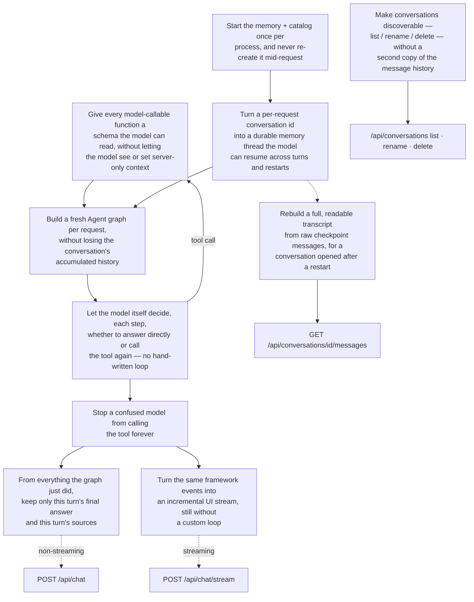

# Agent Runtime Workflow (Tool Gateway + Multi-Round Memory)

> Part of the [System Architecture](architecture.md). [pdf-upload-workflow.md](pdf-upload-workflow.md) covers how documents get in; [query-workflow.md](query-workflow.md) covers what happens inside one chat turn. This document covers the layer underneath both chat endpoints: how `search_uploaded_docs` became *just a normal tool* instead of a hardcoded pipeline step, and how the Agent remembers a conversation across turns and backend restarts without the application writing its own loop or its own message store.

Like the upload doc, this explains the code as a chain of problems being solved. Unlike the upload doc, most of these problems are solved by *not* writing code — by handing the loop, the schema, and the persistence to LangChain/LangGraph and configuring them correctly.

## Diagram

## Step-by-Step: How Each Piece Solves Its Problem

### 1. Starting the memory once per process (`backend/app/main.py::lifespan()`, `backend/app/agent/runtime.py::AgentRuntime.start()`)

The problem: the SQLite checkpointer and the conversation catalog must exist before the first request and must be shared by every request in the process — creating either one per-request would either lose memory between requests or corrupt the file under concurrent writers.

1. FastAPI's `lifespan` context creates exactly one `AgentRuntime(CHAT_DB_PATH)` when the app starts and stores it on `app.state`.
2. `AgentRuntime.start()` opens one SQLite connection with WAL mode and a 5-second busy timeout, wraps it in a LangGraph `SqliteSaver`, and calls `checkpointer.setup()` to create LangGraph's own tables.
3. It also starts the `ConversationStore`, which owns a second connection to the *same* file and creates its own `app_conversations` table (prefixed so it can never collide with LangGraph's tables).
4. `AgentRuntime.close()` runs at shutdown, so the connection is closed cleanly rather than leaking across reloads.
5. Guarded by a re-entrant lock, so `start()` is a no-op if called twice — nothing downstream has to know or care whether this is the first request.

### 2. Turning a conversation id into a memory thread (`backend/app/agent/runtime.py::AgentRuntime._config()`)

The problem: LangGraph persists and restores message history per `thread_id`. The application's concept is a `conversation_id`. These need to be the same value, every time, or memory silently breaks.

1. Every chat request supplies `conversation_id`, validated by `ChatRequest` (`backend/app/schemas.py`) to be a real UUID before it ever reaches the Agent.
2. `_config()` builds `{"configurable": {"thread_id": conversation_id}, "recursion_limit": RECURSION_LIMIT}` — the same dict shape LangChain's `create_agent` expects.
3. Because this mapping is a straight pass-through, two requests with the same `conversation_id` always land on the same LangGraph thread, and different ids are always isolated — there is nothing in between that could scramble it.

### 3. Building a fresh Agent per request without losing history (`backend/app/agent/chat_agent.py::build_agent()`)

The problem: the tool needs per-request context (which OpenAI key, which `top_k`, which user), but the *memory* of the conversation must survive across requests, not be rebuilt from scratch.

1. `build_agent()` is called on every single chat turn — it is cheap because it only constructs Python objects (a tool closure, a `ChatOpenAI` instance), it does not touch SQLite.
2. It is handed the *same* `checkpointer` object every time — the one `AgentRuntime` created once at startup — so the request-scoped pieces (model, tool, system prompt) are new, but the memory underneath them is not.
3. `create_agent(model=llm, tools=[search_tool], system_prompt=SYSTEM_PROMPT, checkpointer=checkpointer)` is LangChain's own factory. It returns a compiled LangGraph graph — the application never builds a state machine by hand.

### 4. Turning a plain function into a tool the model can call (`backend/app/agent/tools.py::make_search_tool()`, `UserContext`)

The problem: the model needs to be able to decide, on its own, to call `search_uploaded_docs` — but it must never see or control server-only values like which session issued the request, and its visible schema should carry no more than what it actually needs to fill in.

1. `UserContext` (`user_id`, `department_id`, `session_id`) is built once per request from data the *server* already has — never from anything the model outputs.
2. `make_search_tool(user_context, top_k)` closes over that context and `top_k`, then defines an inner `@tool`-decorated function whose only parameter is `query`.
3. Because `user_context` and `top_k` are captured by closure rather than declared as tool parameters, the LLM-visible schema exposes only `query` — there is no way for the model to forge or overwrite the user context, intentionally or by hallucination.
4. This is what makes the search tool "just a normal tool" from the graph's point of view: nothing about it is special-cased in the Agent loop. It is one entry in the `tools=[...]` list `create_agent` was given, and the model treats it like any other callable.

### 5. Letting the model decide the loop, with no hand-written orchestration (`langchain.agents.create_agent`, `backend/app/agent/chat_agent.py::SYSTEM_PROMPT`)

The problem: some questions need document lookup, some don't, and some need it more than once (multi-part questions). Hardcoding "always retrieve, then generate" wastes a call on small talk; hardcoding "retrieve once" breaks multi-part questions.

1. The compiled graph alternates between a model node and a tool node: the model reads the conversation so far and either produces a final answer or emits one or more tool calls; if it emits tool calls, the graph runs them and feeds the results back to the model node; this repeats until the model responds without a tool call.
2. The application does not implement this alternation — LangGraph does. The application's only influence over *when* the tool gets called is the system prompt, which instructs the model to use the tool for fact-based questions about the user's documents and skip it for small talk, general knowledge, or arithmetic.
3. Because the decision lives in the model, not in `if/else` branches in the backend, the same code path handles a single-tool-call question and a multi-part question that needs two searches.

### 6. Bounding the loop (`backend/app/agent/chat_agent.py::MAX_TOOL_ITERATIONS`, `RECURSION_LIMIT`; `backend/app/agent/runtime.py::run_chat()` / `stream_chat()`)

The problem: an unbounded model↔tool loop is a real failure mode (a model that keeps re-querying instead of answering) and must have a hard ceiling that produces a clear result, not a hung request or a stack overflow.

1. `MAX_TOOL_ITERATIONS = 3`; `RECURSION_LIMIT = 2 * MAX_TOOL_ITERATIONS + 1 = 7` — the `2x + 1` accounts for LangGraph counting each model step and each tool step as one graph step, plus the final answering step.
2. This limit is passed as `recursion_limit` inside the same config dict that carries `thread_id`, so LangGraph enforces it natively — there is no manual counter in application code.
3. If the ceiling is hit, LangGraph raises `GraphRecursionError`. Both `run_chat()` and `stream_chat()` catch it specifically and turn it into a clear, user-facing message/event instead of a raw exception or an infinite loop.

### 7. Keeping only this turn's answer and sources (`backend/app/agent/runtime.py::run_chat()`, `backend/app/agent/chat_agent.py::sources_from_messages()` / `deduplicate_sources()`)

The problem: the checkpoint returned by `agent.invoke()` contains the *entire* conversation history, not just what just happened — extracting the wrong slice would either miss the answer or re-surface sources from three questions ago as if they were retrieved just now.

1. Before invoking the graph, `run_chat()` records how many messages the thread already had (`previous_message_count`).
2. After invoking, it slices `messages[previous_message_count:]` — only what this turn actually added.
3. The final answer is the last `AIMessage` in that slice that has content and no pending tool call — i.e., the model's concluding response, not an intermediate "I'm going to call a tool" message.
4. Sources come only from `ToolMessage`s in that same slice, parsed for `status == "success"` citations and deduplicated by chunk id. A question answered without touching the tool correctly produces an empty source list.

### 8. Rebuilding a readable transcript from raw checkpoint state (`backend/app/agent/runtime.py::get_display_history()`)

The problem: LangGraph's checkpoint is a flat list of `HumanMessage` / `AIMessage` / `ToolMessage` objects in execution order. The UI needs turns: a user message, then an assistant message with the sources that produced it — reconstructed correctly even for a conversation opened after a backend restart, where nothing is cached in memory.

1. Walk every persisted message in order.
2. A `HumanMessage` starts a new displayed turn and clears any pending tool messages left over from a previous turn.
3. A `ToolMessage` is buffered, not displayed directly — it's evidence, not an answer.
4. A final `AIMessage` (content present, no tool call) closes the turn: it is displayed together with whichever `ToolMessage`s were buffered since the last `HumanMessage`, which is exactly the set of tool calls that produced this specific answer.
5. This function and `run_chat()`'s current-turn logic both walk checkpoint messages, but for different purposes: one full history reconstruction (used by `GET /api/conversations/{id}/messages`), one a live single-turn diff.

### 9. Streaming the same framework events, still with no custom loop (`backend/app/agent/runtime.py::stream_chat()`)

The problem: the UI wants incremental tokens and a `tool_start` notice the moment the model decides to search — without the application re-implementing step 5's model/tool alternation just to observe it.

1. `agent.stream(..., stream_mode=["messages", "updates"], durability="sync")` asks LangGraph for two interleaved event streams instead of one final result.
2. `"messages"` mode yields raw token/message deltas from the model node — buffered and only flushed once the corresponding `"updates"` event confirms whether that message became a tool call or a final answer (a message that turns into a tool call must not be flushed to the UI as answer text).
3. `"updates"` mode yields node-level state diffs: a `model` update with `tool_calls` becomes a `tool_start` event (one per call, with its query); a `tools` update becomes a `sources` event, deduplicated against everything already sent this turn.
4. `durability="sync"` ensures the checkpoint is durably written before the stream reports `done` — a client that reconnects after `done` will always see the completed turn.
5. The same `GraphRecursionError` handling from step 6 applies here, translated into an `error` event instead of a raised exception, since this is a generator feeding an HTTP streaming response.

### 10. Making conversations discoverable without duplicating messages (`backend/app/agent/conversation_store.py::ConversationStore`)

The problem: the UI needs to list, title, and manage conversations, but message truth already lives in LangGraph's checkpoint tables — a second full message store would be one more thing to keep in sync and could drift from what the Agent actually remembers.

1. `ConversationStore` owns exactly one table, `app_conversations`, holding only `id`, `title`, `created_at`, `updated_at` — never message content.
2. `ensure(conversation_id, first_question)` is an `INSERT OR IGNORE`: the catalog row is created lazily, on the *first successful* turn, not when the frontend generates a UUID for an unsaved chat — so abandoned chats never appear in the sidebar.
3. The initial title is derived from the first question, truncated to a fixed length; `rename()` lets the user override it later.
4. `touch()` updates `updated_at` after every turn, which is what lets `list()` order conversations by most-recent activity.
5. `delete()` removes only the catalog row. Deleting the actual memory is a separate call (`AgentRuntime.delete_conversation_state()` → `checkpointer.delete_thread()`) — see step 11 — so a conversation can never end up "listed but empty" or "gone from LangGraph but still listed."

### 11. Wiring conversation management onto the runtime (`backend/app/api/conversations.py`, `backend/app/agent/runtime.py::delete_conversation_state()`)

The problem: expose the catalog as an HTTP API without letting a caller manage catalog metadata and Agent memory as two independent, driftable things.

1. `GET /api/conversations` lists catalog rows; `GET /api/conversations/{id}/messages` combines a catalog lookup (404 if missing) with step 8's checkpoint-driven history reconstruction.
2. `PATCH /api/conversations/{id}` renames the catalog row only — LangGraph has no concept of a conversation title, so there's nothing else to update.
3. `DELETE /api/conversations/{id}` always does both halves: `runtime.conversations.delete()` (catalog) and `runtime.delete_conversation_state()` (LangGraph checkpoints for that `thread_id`), so a deleted conversation is completely gone, not just hidden from the sidebar.
4. Delete is idempotent by design: the response's `deleted` field reports whether a catalog row existed, but the checkpoint delete always runs — calling delete twice on the same id is safe.

## Why This Design, Not a Hand-Written Loop

Before this layer existed, retrieval was a mandatory hardcoded step: every question triggered a search, whether or not the question needed one, and there was no memory between requests — each call was answered from scratch. Making `search_uploaded_docs` "just a normal tool" and handing message persistence to LangGraph's `SqliteSaver` changes both of those trade-offs at once, without the application maintaining a state machine, a token loop, or a hand-rolled message table:

- The model — not an `if` statement — decides whether a question needs document lookup.
- A conversation survives a page refresh or a backend restart because its memory lives in SQLite, addressed by `thread_id`, not in a process-local variable.
- Adding a second tool in the future means adding one more entry to the `tools=[...]` list in `build_agent()` — the loop, the recursion bound, and the checkpointing already handle an arbitrary tool, not just this one.

## Related Documents

- [architecture.md](architecture.md) — where this layer sits relative to the API, Data Layer, and Storage.
- [query-workflow.md](query-workflow.md) — the request/response contract of a single chat turn, including the no-key fallback path and the full failure-semantics table.
- [pdf-upload-workflow.md](pdf-upload-workflow.md) — how content gets into the store this Agent's tool searches.