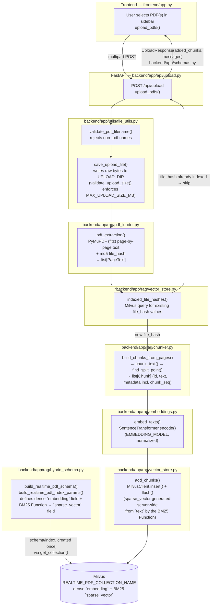
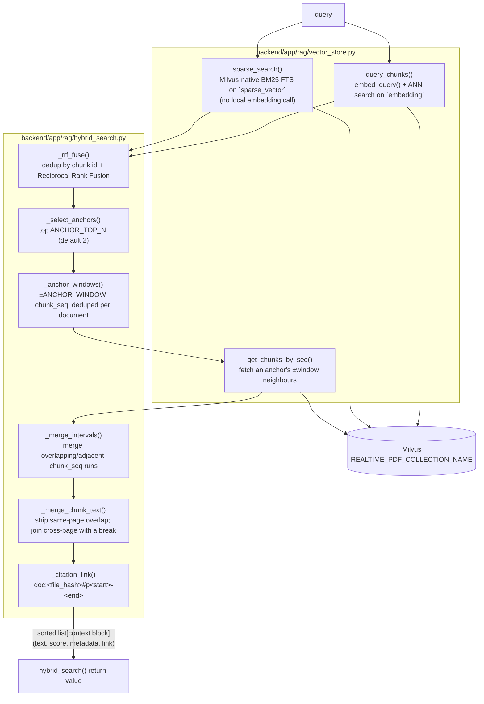
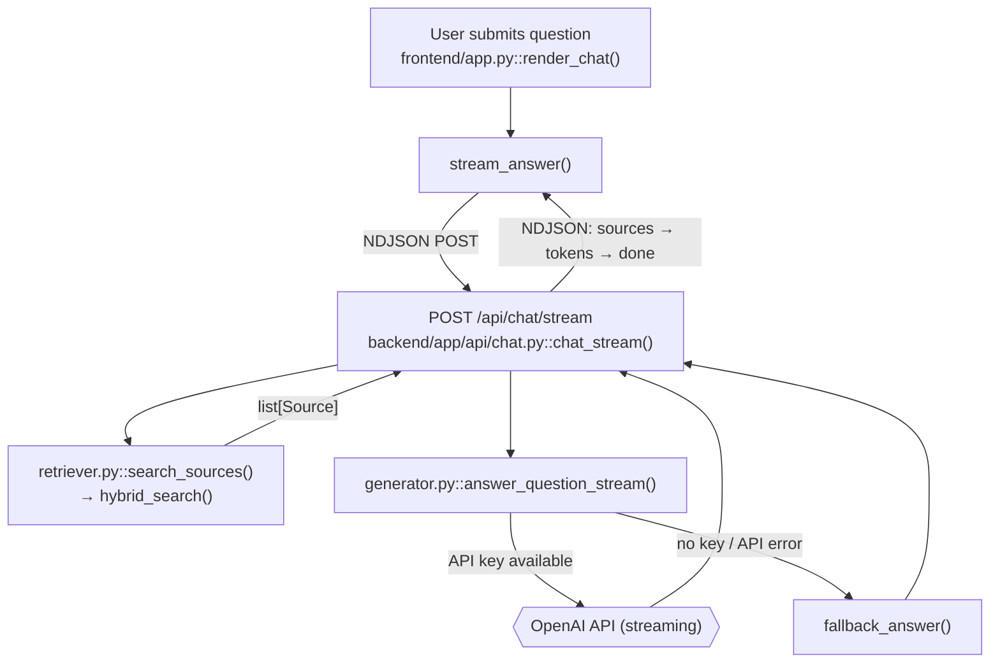
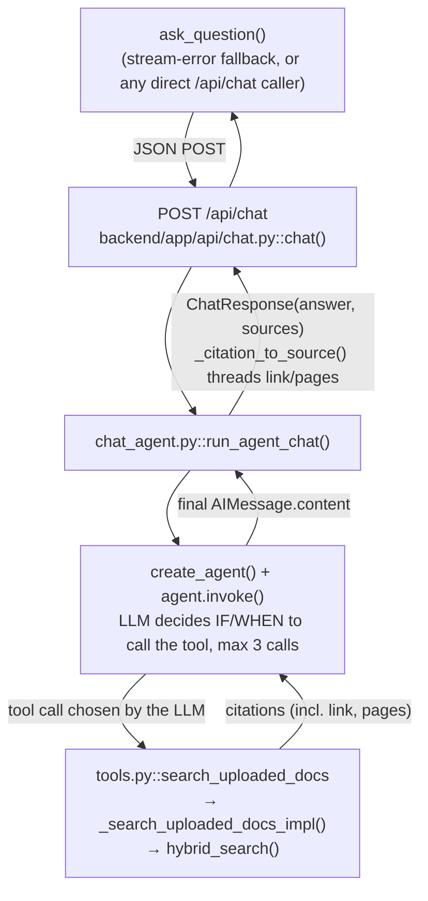

# Architecture

This document describes the repository layout and the high-level RAG flow for RAG Document Chat.

## 1. Project Structure

```text
RAG_Document_Chat/
├── README.md
├── .env
├── .gitignore
├── docker-compose.yml
├── docs/
│   ├── architecture.md
│   └── screenshots/
│       ├── .gitkeep
│       └── evaluation_score.png
├── sample_docs/
│   ├── employee_handbook_de.pdf
│   ├── employee_handbook_en.pdf
│   ├── product_manual_de.pdf
│   ├── product_manual_en.pdf
│   ├── service_agreement_de.pdf
│   └── service_agreement_en.pdf
├── scripts/
│   ├── test_pdf_loader_chunker.py
│   ├── test_rag_retrieval.py
│   ├── test_hybrid_search.py
│   ├── test_hybrid_search_merge.py
│   ├── test_hybrid_vector_store.py
│   ├── test_retriever_hybrid.py
│   ├── validate_pdf_extraction.py
│   └── validate_setup.py
├── backend/
│   ├── Dockerfile
│   ├── requirements.txt
│   ├── data/
│   │   ├── huggingface/
│   │   └── uploads/
│   │       └── .gitkeep
│   ├── scripts/
│   │   └── smoke_test_pdf_loader.py
│   └── app/
│       ├── main.py
│       ├── config.py
│       ├── schemas.py
│       ├── api/
│       │   ├── __init__.py
│       │   ├── chat.py
│       │   ├── documents.py
│       │   ├── evaluation.py
│       │   └── upload.py
│       ├── agent/
│       │   ├── chat_agent.py
│       │   └── tools.py
│       ├── data/
│       │   └── test_cases.py
│       ├── rag/
│       │   ├── __init__.py
│       │   ├── chunker.py
│       │   ├── embeddings.py
│       │   ├── evaluator.py
│       │   ├── generator.py
│       │   ├── hybrid_schema.py
│       │   ├── hybrid_search.py
│       │   ├── pdf_loader.py
│       │   ├── prompts.py
│       │   ├── retriever.py
│       │   ├── types.py
│       │   └── vector_store.py
│       └── utils/
│           ├── __init__.py
│           └── file_utils.py
└── frontend/
    ├── Dockerfile
    ├── requirements.txt
    └── app.py
```

### Directory Overview

- `backend/`: FastAPI backend service, including API routes, RAG pipeline modules, configuration, schemas, and utilities.
- `backend/app/api/`: HTTP API endpoints for upload, chat, streaming chat, document management, and evaluation.
- `backend/app/agent/`: LangChain tool-calling agent (`chat_agent.py`) and the `search_uploaded_docs` tool (`tools.py`) used by `POST /api/chat`.
- `backend/app/data/`: Hardcoded evaluation test cases.
- `backend/app/rag/`: Core RAG implementation: PDF loading, chunking, embeddings, Milvus schema/storage (dense + native BM25 sparse), retrieval, reranking, prompts, generation, and evaluation scoring.
- `backend/app/utils/`: Shared backend helper code.
- `backend/data/`: Runtime data directory for uploaded PDFs and Hugging Face model cache. Docker Compose mounts this directory into the backend container. Vector data is stored in Milvus, not on this local disk.
- `backend/scripts/`: Backend-specific smoke tests and helper scripts.
- `frontend/`: Streamlit frontend application and Docker/dependency configuration.
- `sample_docs/`: Sample PDFs used by the fixed retrieval evaluation benchmark.
- `scripts/`: Project-level validation and RAG/PDF test scripts.
- `docs/`: Architecture documentation and local run screenshots.

Generated Python caches, virtual environments, local screenshots, and model-cache files are intentionally not listed in detail.

## 2. PDF Upload Workflow

Every node below names the exact file and function that implements that step.



Notes:
- One upload request can contain multiple files; `upload_pdfs()` (`backend/app/api/upload.py`) loops per file, so a file that fails validation doesn't block the others.
- Dedup is by MD5 `file_hash` of the raw PDF bytes, computed in `pdf_extraction()` (`backend/app/rag/pdf_loader.py`), checked against `indexed_file_hashes()` (`backend/app/rag/vector_store.py`) before chunking/embedding runs.
- Chunk boundaries are page-scoped: `build_chunks_from_pages()` (`backend/app/rag/chunker.py`) never merges text across pages, which is what keeps page-level citations accurate.
- Every chunk row is indexed twice for retrieval: `add_chunks()` writes the dense `embedding` vector directly, while Milvus computes the `sparse_vector` (BM25) field itself from the `text` field via a native `Function` defined in `hybrid_schema.py` — the backend never computes or inserts sparse vectors.

### Step-by-Step Breakdown 

Each block below corresponds to a node in the diagram above (A–H, plus the schema-definition module). The description explains what the code does and how that behavior contributes to the overall goal: indexing a PDF exactly once, split into citable, embeddable chunks that are retrievable by both dense and sparse (BM25) search.

**A — `frontend/app.py::upload_pdfs()`**
The Streamlit sidebar's file uploader collects one or more PDFs (`st.file_uploader(..., accept_multiple_files=True)`). On clicking "Start Indexing", `upload_pdfs()` re-packs each file as a `(filename, raw_bytes, "application/pdf")` tuple and sends a single `multipart/form-data POST` to `/api/upload` with a 300s timeout (large PDFs / cold embedding-model load can be slow). The frontend does no validation itself — every check happens server-side — so this block's only job is transport.

**B — `backend/app/api/upload.py::upload_pdfs()`**
This is the orchestrator for the whole workflow — every other block (C through H) is called from inside this one function. Its structure:
1. Calls `indexed_file_hashes()` **once**, before the loop, to build an in-memory `set[str]` of hashes already in Milvus. Reusing one snapshot across all files in the request (rather than re-querying per file) is what makes duplicate-detection cheap for a multi-file upload.
2. Loops over `files: list[UploadFile]`. For each file it validates the name, saves it, extracts text, checks the hash against the snapshot, chunks, embeds+inserts, and appends a human-readable status message (`✅`/`📄`/`⚠️`) — this is why a bad file doesn't abort the batch: exceptions from a single iteration would only need to be caught to skip that file, and the per-file `continue` statements do exactly that for the "already indexed" and "no extractable text" cases.
3. Any unhandled exception in the whole block (e.g. a corrupt PDF `pdf_extraction()` can't open) is caught by the outer `try/except` and turned into an HTTP 400 — so it fails the *whole request*, not just one file, which is only a real risk for genuinely malformed uploads (not for duplicates or empty files, which are handled explicitly).
4. Returns `UploadResponse(added_chunks, messages)` (`backend/app/schemas.py`), which the frontend renders as one `st.success()` line per file.

**C1 — `backend/app/utils/file_utils.py::validate_pdf_filename()`**
Takes the raw filename reported by the client and strips it down with `Path(filename).name`, which discards any directory component (defense against path traversal via a crafted filename like `../../etc/passwd.pdf`). It then rejects empty names and anything whose suffix isn't `.pdf` (case-insensitive). This is the first gate a file must pass — nothing is written to disk yet.

**C2 — `backend/app/utils/file_utils.py::save_upload_file()` / `validate_upload_size()`**
`save_upload_file()` re-validates the filename, calls `validate_upload_size()` (seeks to the end of the underlying `SpooledTemporaryFile` to get its size without reading it fully into memory, compares against `MAX_UPLOAD_SIZE_BYTES` from `config.py`, then seeks back to 0), ensures `UPLOAD_DIR` exists, and writes the raw bytes to `UPLOAD_DIR/<file_name>`. Note this **overwrites** any existing file with the same name on disk — the durable dedup guard is the Milvus `file_hash` check (block E), not the filename. The returned `Path` is what block D reads from.

**D — `backend/app/rag/pdf_loader.py::pdf_extraction()`**
Opens the saved file with PyMuPDF (`fitz.open`) and does two things per page: extracts plain text via `page.get_text()`, and computes an MD5 digest of the entire file's raw bytes once up front (`hashlib.md5(pdf_path.read_bytes())`) — the same hash is attached to every page, since the hash identifies the *document*, not the page. Pages whose extracted text is empty/whitespace-only are silently dropped (e.g. a scanned image page with no text layer), so the output `list[PageText]` may have fewer entries than the PDF has pages. Any PyMuPDF failure (corrupt file, encrypted PDF) is wrapped in a `ValueError` that propagates up to block B's `except` handler.

**E — `backend/app/rag/vector_store.py::indexed_file_hashes()`**
This is the dedup check. It calls `get_collection()` to obtain the (lazily created) `MilvusClient`, then issues a Milvus `query()` with an empty filter (`filter=""`, matching all rows) but only requesting the `file_hash` output field, capped at `limit=16384` rows. It reduces the result to a Python `set` via a comprehension — the set (not a list) matters because block B does an O(1) `in` check against it per file. Because `file_hash` is duplicated on every chunk row of a document, this query returns one row per *chunk*, not per document; the set comprehension collapses that back down to unique hashes. In `upload_pdfs()`, `pages[0].file_hash` (identical across all pages of that file) is compared against this set — if present, chunking/embedding/insertion (F, G, H) are skipped entirely for that file, which is the main cost-saving the whole workflow is built around: embeddings are the expensive step, so this check runs before them.

**F — `backend/app/rag/chunker.py::build_chunks_from_pages()`**
For each `PageText`, calls `chunk_text()` to split that page's text into overlapping windows (default `CHUNK_SIZE=950` chars, `CHUNK_OVERLAP=180` chars, from `config.py`). `chunk_text()` first normalizes whitespace (`normalize_text()`), then slides a window across the text; when a window would cut mid-sentence, `find_split_point()` looks backward from the window's end for the best available boundary — paragraph break, then line break, then sentence end (`". "`), then word boundary — as long as that boundary is past 55% of the window (`min_split`), to avoid tiny chunks. Because the outer loop is over pages (not the whole document), a chunk never spans two pages, so every chunk can be attributed to exactly one page number for citations. Each chunk gets a deterministic `id` (`"{file_hash}:p{page}:c{chunk_index}"`) and a `metadata` dict — `document_name`, `file_hash`, `page`, `chunk_index` (position within its page, resets at each page boundary), and `chunk_seq` (position within the whole document, monotonic across all pages of that upload) — that Milvus will later store as dynamic fields.

**G — `backend/app/rag/embeddings.py::embed_texts()`**
Loads the `SentenceTransformer` model named by `EMBEDDING_MODEL` (default `paraphrase-multilingual-MiniLM-L12-v2`, chosen for the German/English sample docs) once via `@lru_cache(maxsize=1)`, so repeated calls across the process's lifetime reuse the same model instance instead of reloading it from disk/Hugging Face cache. `model.encode(texts, normalize_embeddings=True)` runs a batched forward pass and L2-normalizes each output vector — normalization is what makes cosine similarity (used by block H's dense index) equivalent to a plain dot product at search time. Returns plain Python lists (`.tolist()`) since Milvus's client doesn't accept numpy arrays directly.

**Schema — `backend/app/rag/hybrid_schema.py::build_realtime_pdf_schema()` / `build_realtime_pdf_index_params()`**
Not a step in the per-upload flow, but the module that defines the collection block H creates the first time it's needed. `build_realtime_pdf_schema()` defines an auto-ID collection with `enable_dynamic_field=True` (so `document_name`/`file_hash`/`page`/`chunk_index`/`chunk_seq` ride along as dynamic fields, same as before), a `text` field with `enable_analyzer=True`, a dense `FLOAT_VECTOR` `embedding` field, and a `SPARSE_FLOAT_VECTOR` `sparse_vector` field that is never written to directly — it's populated by an attached Milvus-native `Function` (`text_bm25_emb`, `FunctionType.BM25`) that tokenizes `text` and derives the sparse vector server-side on insert. `build_realtime_pdf_index_params()` adds two indexes: `embedding` gets `AUTOINDEX`/`COSINE` (dense/semantic search), `sparse_vector` gets `AUTOINDEX`/`BM25` (sparse/keyword search) — the two indexes are what make the same collection usable for hybrid retrieval.

**H — `backend/app/rag/vector_store.py::add_chunks()`**
The final write step, and the second function in this file the workflow relies on. It short-circuits on an empty chunk list, otherwise:
1. Calls `get_collection()` — on the very first call in the process, this is also where the Milvus collection is *created*: it probes the embedding dimension with a throwaway `embed_query("dimension probe")` call, then delegates schema and index construction to `build_realtime_pdf_schema()` / `build_realtime_pdf_index_params()` (`hybrid_schema.py`, see above) before calling `load_collection()` so it's queryable.
2. Embeds all chunk texts in one batched call to `embed_texts()` (block G) rather than one call per chunk — this is why chunking happens before embedding rather than embedding page-by-page. Only the dense vector is computed here; the sparse vector is not.
3. Zips each chunk with its dense vector into a row dict — `{"text": ..., "embedding": ..., **chunk.metadata}` — spreading `metadata` directly into the row is what populates the dynamic fields. There is no `sparse_vector` key in this dict; Milvus derives it from `text` at insert time via the schema's BM25 `Function`.
4. `client.insert()` followed immediately by `client.flush()`. The explicit flush matters: Milvus inserts are buffered, and without flushing, a `query_chunks()`/`indexed_file_hashes()` call issued moments later (e.g. from the next file in the same upload batch, or the very next chat query) could miss the just-inserted rows. Flush trades a small amount of latency here for read-after-write consistency.
5. Returns `len(chunks)`, which block B accumulates into `added_chunks` and reports as "Indexed N text clauses" per file.

## 3. Query Workflow (Chat)

Both chat paths below call the same hybrid retrieval core, `hybrid_search()` (`backend/app/rag/hybrid_search.py`) — dense + BM25 search, RRF fusion, dedup by chunk id, anchor selection, ±1 `chunk_seq` context assembly, and a citable link per block. Full design rationale: `docs/superpowers/specs/2026-08-16-hybrid-query-retrieval-design.md`. They differ in everything *around* retrieval:

| | Entry point | Used when |
| --- | --- | --- |
| **A. Direct retrieval pipeline** | `POST /api/chat/stream` → `chat_stream()` | Default path — the Streamlit chat UI calls `stream_answer()` (`frontend/app.py`) for every message. Always retrieves. |
| **B. Agent** | `POST /api/chat` → `chat()` | Fallback — `stream_answer()` falls back to `ask_question()` if the stream request fails; also the endpoint any direct API client hits. The LLM decides whether to call `search_uploaded_docs` at all. |

### 3.1 Hybrid Retrieval Core (shared)



Anchors without a `chunk_seq` (pre-existing fixtures/chunks) skip the window/merge steps and become a single-chunk block built directly from the anchor — see `_anchor_to_row()`.

### 3.2 Path A — Direct Retrieval Pipeline



### 3.3 Path B — Agent



Key differences between the two paths:
- **Whether retrieval happens at all**: Path A always retrieves. Path B's agent can skip `search_uploaded_docs` entirely (small talk, general knowledge) — see `_SYSTEM_PROMPT` in `backend/app/agent/chat_agent.py`.
- **Fallback without an OpenAI key**: Path A degrades to `fallback_answer()` (extractive excerpts). Path B has no such fallback — `run_agent_chat()` always constructs a `ChatOpenAI` client.
- **Output shape**: Path A produces `Source` objects directly from `hybrid_search()` blocks. Path B produces tool citation dicts first (`_search_uploaded_docs_impl()`), which `_citation_to_source()` then converts to `Source` — same final fields (`document`, `page`, `pages`, `chunk`, `text`, `link`), `score` is always `None` on Path B since the tool's citation payload doesn't carry the block's RRF score.

## Backend and Frontend Responsibilities

### Backend

- Validates PDF uploads and file size limits.
- Extracts page-level text from PDFs.
- Builds overlapping chunks with document/page/chunk metadata.
- Stores chunks in a Milvus collection.
- Runs hybrid (dense + BM25) retrieval with RRF fusion and anchor/context assembly for both `/api/chat/stream` and `/api/chat` (see [Query Workflow](#3-query-workflow-chat)) — one shared retrieval core, `hybrid_search()`.
- Runs a LangChain tool-calling agent for `/api/chat`, which decides whether to search the uploaded documents at all (Path B).
- Generates answers with OpenAI when an API key is available.
- Falls back to extractive answers when no API key is available (direct pipeline only — the agent path has no fallback).

### Frontend

- Provides PDF upload and document management UI.
- Provides chat and streaming answer UI.
- Shows source document, page, chunk, excerpt, and rank score.
- Allows request-scoped OpenAI API key input.
- Provides the fixed evaluation panel and missing-sample-document warning.

## Storage

- Uploaded PDFs are stored under `backend/data/uploads/`.
- Chunk text, embeddings, and metadata are stored in Milvus (`MILVUS_HOST`/`MILVUS_PORT`, collection `REALTIME_PDF_COLLECTION_NAME`), which runs as its own service outside this repo's `docker-compose.yml`.
- Hugging Face model cache is stored under `backend/data/huggingface/` in Docker.
- Docker Compose mounts `backend/data/` into the backend container so uploaded files and the model cache survive container restarts.
