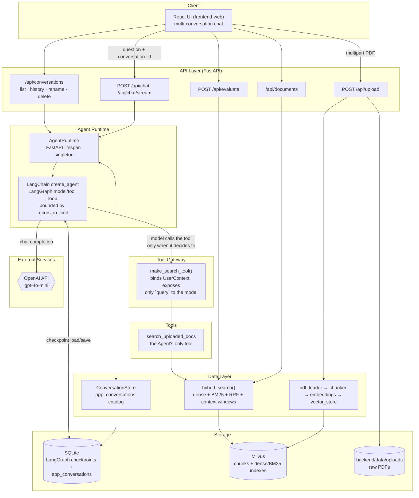
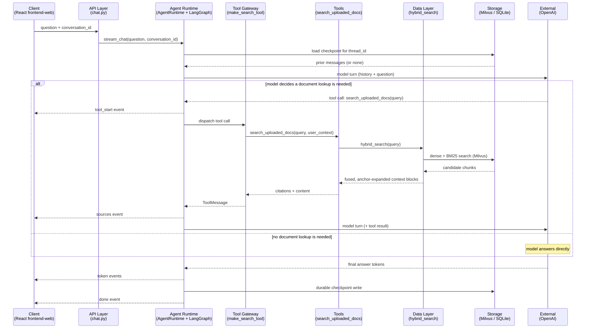

# Architecture

This document describes the repository layout and the high-level system architecture for RAG Document Chat.

## 1. Project Structure

```text
RAG_Document_Chat/
├── README.md
├── .env
├── .gitignore
├── docker-compose.yml
├── docs/
│   ├── architecture.md
│   ├── pdf-upload-workflow.md
│   ├── query-workflow.md
│   ├── agent-runtime-workflow.md
│   └── screenshots/
│       ├── .gitkeep
│       ├── Chat_with_source.png
│       ├── Evaluation_score.png
│       └── Query_process.mov
├── sample_docs/
│   ├── employee_handbook_de.pdf
│   ├── employee_handbook_en.pdf
│   ├── product_manual_de.pdf
│   ├── product_manual_en.pdf
│   ├── service_agreement_de.pdf
│   └── service_agreement_en.pdf
├── scripts/
│   ├── test_pdf_loader_chunker.py
│   ├── test_rag_retrieval.py
│   ├── test_hybrid_search.py
│   ├── test_hybrid_search_merge.py
│   ├── test_hybrid_vector_store.py
│   ├── test_retriever_hybrid.py
│   ├── test_agent_memory.py
│   ├── test_agent_stream_events.py
│   ├── test_conversation_api.py
│   ├── test_conversation_schemas.py
│   ├── test_conversation_store.py
│   ├── test_current_turn_citations.py
│   ├── test_persistent_agent_e2e.py
│   ├── validate_pdf_extraction.py
│   └── validate_setup.py
├── backend/
│   ├── Dockerfile
│   ├── requirements.txt
│   ├── data/
│   │   ├── huggingface/
│   │   ├── uploads/
│   │   │   └── .gitkeep
│   │   └── chat_history.sqlite
│   ├── scripts/
│   │   └── smoke_test_pdf_loader.py
│   └── app/
│       ├── main.py
│       ├── config.py
│       ├── schemas.py
│       ├── api/
│       │   ├── __init__.py
│       │   ├── chat.py
│       │   ├── conversations.py
│       │   ├── documents.py
│       │   ├── evaluation.py
│       │   └── upload.py
│       ├── agent/
│       │   ├── chat_agent.py
│       │   ├── conversation_store.py
│       │   ├── runtime.py
│       │   └── tools.py
│       ├── data/
│       │   └── test_cases.py
│       ├── rag/
│       │   ├── __init__.py
│       │   ├── chunker.py
│       │   ├── embeddings.py
│       │   ├── evaluator.py
│       │   ├── generator.py
│       │   ├── hybrid_schema.py
│       │   ├── hybrid_search.py
│       │   ├── pdf_loader.py
│       │   ├── prompts.py
│       │   ├── retriever.py
│       │   ├── types.py
│       │   └── vector_store.py
│       └── utils/
│           ├── __init__.py
│           └── file_utils.py
└── frontend-web/
    ├── src/
    │   ├── api/
    │   ├── components/
    │   ├── hooks/
    │   ├── pages/
    │   ├── store/
    │   ├── types/
    │   ├── App.tsx
    │   └── main.tsx
    ├── package.json
    ├── vite.config.ts
    ├── nginx.conf
    └── Dockerfile
```

### Directory Overview

- `backend/`: FastAPI backend service, including API routes, Agent runtime, RAG pipeline modules, configuration, schemas, and utilities.
- `backend/app/api/`: HTTP API endpoints for upload, chat (sync + streaming), conversation management, document management, and evaluation.
- `backend/app/agent/`: The Agent Runtime and Tool Gateway — LangChain `create_agent` construction, LangGraph/SQLite lifecycle runtime, conversation metadata catalog, and the single `search_uploaded_docs` tool.
- `backend/app/data/`: Hardcoded evaluation test cases.
- `backend/app/rag/`: Core RAG implementation — PDF loading, chunking, embeddings, Milvus schema/storage (dense + native BM25 sparse), hybrid retrieval, prompts, generation, and evaluation scoring. This is where the Agent's `search_uploaded_docs` tool and the no-key fallback both do their work.
- `backend/app/utils/`: Shared backend helper code.
- `backend/data/`: Runtime data — uploaded PDFs, Hugging Face model cache, and the default persistent chat SQLite file. Vector data is stored in Milvus.
- `backend/scripts/`: Backend-specific smoke tests and helper scripts.
- `frontend-web/`: React (Vite + TypeScript) frontend — API client, hooks, components, pages, and Docker/nginx static-serve configuration.
- `sample_docs/`: Sample PDFs used by the fixed retrieval evaluation benchmark.
- `scripts/`: Project-level validation and RAG/PDF/Agent test scripts.
- `docs/`: Architecture documentation, per-workflow deep dives, and local run screenshots. `docs/superpowers/` additionally holds internal design specs and implementation plans that motivated each change; they are development history, not user-facing documentation.

Generated Python caches, virtual environments, local screenshots, and model-cache files are intentionally not listed in detail.

## 2. System Architecture

The chat path is a persistent LangChain Agent compiled by `create_agent`. LangGraph owns the model/tool execution cycle and checkpoints its message state to SQLite. The application does not hand-write an Agent loop — it adds lifecycle wiring, a single tool, conversation metadata, API serialization, and UI controls around that framework-owned graph.

The architecture is organized into seven layers. Each one has a single, narrow responsibility, and every arrow below crosses exactly one layer boundary:

| Layer | Responsibility | Code |
| --- | --- | --- |
| **Client** | Renders chat/upload UI, holds `conversation_id`, replays streamed events. | `frontend-web/src/` |
| **API** | HTTP surface: request validation, response shaping, choosing the Agent path vs. the no-key fallback path. | `backend/app/api/*.py` |
| **Agent Runtime** | Owns the compiled LangGraph graph, the SQLite checkpointer, and the conversation catalog. Builds a request-scoped Agent per turn and invokes/streams it. | `backend/app/agent/runtime.py`, `backend/app/agent/chat_agent.py` |
| **Tool Gateway** | Turns a Python function into an LLM-callable tool: defines the model-visible schema, injects server-side context (user/session) that the model never sees or fills in. | `backend/app/agent/tools.py::make_search_tool()` |
| **Tools** | The actual tool implementation(s) the Agent can invoke. Today there is exactly one: `search_uploaded_docs`. | `backend/app/agent/tools.py::_search_uploaded_docs_impl()` |
| **Data Layer** | Framework/business logic that turns a tool call into a data operation: retrieval fusion, chunking, embedding, ingestion, conversation metadata queries. | `backend/app/rag/*.py`, `backend/app/agent/conversation_store.py` |
| **Storage** | Durable systems of record. | Milvus, SQLite (`chat_history.sqlite`), local disk (`backend/data/uploads`), OpenAI (external LLM) |



The model can answer ordinary conversation directly or call `search_uploaded_docs` one or more times. There is no hand-written Agent loop: `create_agent`, the LangGraph runtime, and its recursion limit control model/tool execution. `POST /api/chat` exposes the same persistent Agent as a non-streaming API; the React UI uses `POST /api/chat/stream` to receive native Agent events.

If no OpenAI key exists, the endpoints retain a stateless retrieval/extractive fallback that calls into the Data Layer directly, bypassing the Agent Runtime and Tool Gateway entirely. Because no LLM graph runs in that mode, the streaming response explicitly warns that the turn is not saved to Agent memory.

## 3. Sequence Diagram: A Chat Turn Across Layers

This shows one `POST /api/chat/stream` turn as it crosses every layer above. It is the general shape; the full step-by-step (including the framework's internal model↔tool loop and SQLite checkpointing mechanics) is in [query-workflow.md](query-workflow.md) and [agent-runtime-workflow.md](agent-runtime-workflow.md).



## 4. Key Designs

- **Framework-owned Agent execution.** `chat_agent.py::build_agent()` calls LangChain `create_agent`; `AgentRuntime` invokes or streams the compiled graph. The application does not reproduce the tool-call loop.
- **Persistent thread memory.** Every request includes a UUID `conversation_id`, mapped directly to LangGraph's `thread_id`. `SqliteSaver` restores all prior messages for that thread after page refreshes and backend restarts.
- **Multiple independent conversations.** A small `app_conversations` table stores only discoverability metadata (`id`, `title`, timestamps). Message truth remains in LangGraph checkpoints, so there is no second custom message store to synchronize.
- **A search function is just another tool.** The Tool Gateway wraps `search_uploaded_docs` the same way any LangChain tool is wrapped — model-visible schema plus closure-captured server context. The model decides whether, and how many times, to call it; the application does not hardcode "always retrieve first."
- **Current-turn citations.** API responses derive sources only from new `ToolMessage` objects produced during the current turn. History reconstruction associates persisted tool results with the following final assistant message.
- **Native Agent streaming.** The stream endpoint consumes LangGraph `messages` and `updates` modes and emits NDJSON `tool_start`, `sources`, `token`, `done`, or `error` events.
- **Bounded execution.** The graph recursion limit permits at most three tool rounds before returning a clear limit error.
- **Shared SQLite file, separate ownership.** LangGraph manages checkpoint tables; application code owns only the prefixed `app_conversations` table. WAL mode and a busy timeout support both connections.
- **Conversation deletion is complete.** Delete removes both catalog metadata and all LangGraph checkpoints for the thread.
- **Retrieval remains shared.** The Agent tool and no-key fallback both use the same Data Layer — dense + BM25 retrieval core, RRF fusion, and anchor-window context assembly.

## Backend and Frontend Responsibilities

### Backend

- Ingests PDFs and stores their chunks and indexes in Milvus.
- Starts one process-scoped `AgentRuntime` and SQLite checkpointer during FastAPI lifespan startup.
- Builds a request-scoped model/tool binding while reusing the process-scoped checkpointer.
- Persists Agent messages by `conversation_id` and exposes conversation list/history/rename/delete APIs.
- Streams native Agent progress and citations to the frontend.
- Uses stateless extractive retrieval when no LLM key is available.

### Frontend

- Generates UUIDs for new conversations and includes the active ID with every chat turn.
- Lists, switches, renames, and deletes persisted conversations through backend APIs.
- Restores message history when a conversation is selected or the page reloads.
- Renders tool activity, incremental answer text, and current-turn sources.
- Retains PDF upload/document management, request-scoped API key input, and evaluation UI.

## Storage

| Data | Location | Owner |
| --- | --- | --- |
| Raw uploaded PDFs | `backend/data/uploads/` | Upload API |
| Chunks, embeddings, BM25 index, document metadata | Milvus | RAG storage layer |
| Agent message/checkpoint state | `CHAT_DB_PATH` (default `backend/data/chat_history.sqlite`) | LangGraph `SqliteSaver` |
| Conversation titles and timestamps | `app_conversations` in the same SQLite file | Application catalog |
| Embedding model cache | `backend/data/huggingface/` | sentence-transformers |

Docker Compose mounts `backend/data/` at `/app/data`, so the default SQLite database, uploaded PDFs, and model cache survive backend container recreation. Milvus remains an external service configured through `MILVUS_HOST` and `MILVUS_PORT`.

## 5. Related Documents

- [pdf-upload-workflow.md](pdf-upload-workflow.md) — deep dive into the PDF ingestion pipeline (workflow 1).
- [query-workflow.md](query-workflow.md) — deep dive into a single chat turn: request/persistence model, framework-owned tool decision, streaming events, failure semantics (workflow 2).
- [agent-runtime-workflow.md](agent-runtime-workflow.md) — deep dive into the Agent Runtime and Tool Gateway layers themselves: how a plain function becomes a callable tool, how the model/tool loop is bounded, and how SQLite gives the Agent multi-round memory (workflow 3).