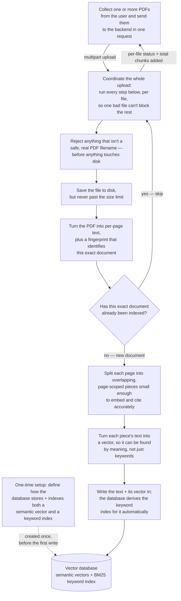

# PDF Upload Workflow

> Part of the [System Architecture](architecture.md) — this file covers workflow **1. PDF Upload** in detail. See `architecture.md` for how this fits alongside the two query workflows.

This document explains the PDF upload pipeline as a chain of problems being solved, not as a list of function calls. Each Mermaid node names the problem that step exists to solve; the breakdown below it explains, in plain language, how the corresponding code solves that problem.

## Diagram

Every problem in the diagram maps to specific, named functions. The rest of this document walks through them in the order they run.

## Step-by-Step: How Each Piece Solves Its Problem

### 1. Collecting the files (`frontend-web/src/components/documents/UploadDropzone.tsx`, `frontend-web/src/api/documents.ts::uploadPdfs()`)

The problem: get one or more files from the user's browser to the backend, without the frontend having to know anything about PDFs.

1. Take whatever files the user dragged onto the dropzone or selected via the file picker.
2. Repackage them into a `FormData` multipart body — the frontend does not open, validate, or inspect the PDF itself.
3. Send all of them to the backend in a single request, without a client-imposed timeout, since a large PDF or a cold embedding model can take a while.
4. Hand back to the UI whatever per-file status messages the backend returns, rendered as toasts, so the user can see what happened to each file.

### 2. Coordinating the upload (`backend/app/api/upload.py::upload_pdfs()`)

The problem: run a multi-step pipeline once per file, without letting one bad file ruin the other files in the same request.

1. Before looking at any file, fetch the set of documents already indexed — once — so every file in this request can be checked against it cheaply, instead of re-querying the database per file.
2. Go through the uploaded files one at a time.
3. For each file: validate its name, save it, extract its text, check whether it's a duplicate, split it into pieces, turn those pieces into searchable entries, and record a short status message (indexed / already indexed / unreadable).
4. If one file turns out to be a duplicate or has no readable text, skip just that file and move on to the next one — it does not stop the batch.
5. If a file is fundamentally broken (e.g. not actually a valid PDF), stop and report the failure for the whole request — this is the one case treated as serious enough to abort, since it usually means something is wrong with the request itself rather than with a single file.
6. Report back how many searchable pieces were added in total, plus one status line per file.

### 3. Rejecting unsafe filenames (`backend/app/utils/file_utils.py::validate_pdf_filename()`)

The problem: don't let a malicious or malformed filename reach the filesystem.

1. Strip away any directory path the client claims the file has — only the plain filename is trusted, which blocks tricks like a filename that tries to escape the intended folder.
2. Reject a file with no name at all.
3. Reject anything whose extension isn't `.pdf` (case-insensitive) — nothing is written to disk until a file passes this check.

### 4. Saving the file safely (`backend/app/utils/file_utils.py::save_upload_file()` / `validate_upload_size()`)

The problem: persist the upload to disk without silently accepting an oversized file or reading the whole thing into memory just to measure it.

1. Re-check the filename is safe.
2. Measure the file's size without loading its contents, and reject it if it's over the configured limit.
3. Make sure the destination folder exists.
4. Write the raw bytes to disk under the (now-validated) filename — a second upload with the same filename overwrites the first; this step doesn't try to prevent duplicates, that's handled later by content, not filename.

### 5. Extracting text and fingerprinting the document (`backend/app/rag/pdf_loader.py::pdf_extraction()`)

The problem: turn a PDF into plain text the rest of the pipeline can work with, while giving every page a way to be traced back to *this exact file*.

1. Compute a fingerprint (content hash) of the file's raw bytes, once, up front — this fingerprint identifies the document itself, not any particular page, so every page from this file will carry the same fingerprint.
2. Open the PDF and read it page by page.
3. Pull the plain text out of each page.
4. Drop any page that has no real text (for example, a scanned image page with nothing selectable) — those pages simply don't appear in the output, rather than being kept as empty entries.
5. If the file can't be opened or read at all (corrupted, encrypted, not really a PDF), report that clearly as a failure for this file rather than crashing the whole request.

### 6. Detecting duplicates before doing expensive work (`backend/app/rag/vector_store.py::indexed_file_hashes()`)

The problem: don't pay to re-process a document that's already been indexed.

1. Ask the database for the fingerprint of every document already stored — every stored piece carries its parent document's fingerprint, so this naturally returns many repeats.
2. Collapse those into a set of unique fingerprints, so checking "have I seen this one?" is an instant lookup rather than a search.
3. This check runs *before* the expensive steps (splitting into pieces, generating vectors) — if the current file's fingerprint is already in the set, everything after this point is skipped for that file. This is the main reason re-uploading the same file twice is cheap.

### 7. Splitting text into citation-safe pieces (`backend/app/rag/chunker.py::build_chunks_from_pages()`, with `chunk_text()` / `find_split_point()` / `normalize_text()`)

The problem: text needs to be split into pieces small enough to turn into a useful vector, without cutting mid-sentence and without losing the ability to say exactly which page a piece of text came from.

1. Clean up each page's text first — collapse stray whitespace and excessive blank lines, without disturbing paragraph structure.
2. Work through the page's text in windows sized to the configured chunk length.
3. When a window would end mid-sentence, look backward from the end of that window for the best nearby place to actually stop: prefer a paragraph break, then a line break, then the end of a sentence, then at least a word boundary — never a completely mid-word cut.
4. Let consecutive pieces overlap slightly, so context isn't completely lost at a cut point.
5. Never let a piece span two pages — the loop processes one page at a time, which is what guarantees every piece can be attributed to exactly one page number later.
6. Tag every piece with where it came from: which document, which page, its position within that page, and its position within the whole document so far — this bookkeeping is what later makes accurate citations and "neighbouring context" lookups possible.

### 8. Turning text into a searchable vector (`backend/app/rag/embeddings.py::embed_texts()` / `embed_query()` / `load_embedding_model()`)

The problem: text needs to become a numeric representation that can be compared for *meaning*, not just exact wording, and doing that repeatedly should be fast.

1. Load the embedding model once and reuse it for the lifetime of the backend process, instead of reloading it from disk for every request.
2. Feed all of a file's text pieces through the model in a single batch call, rather than one at a time — this is why splitting happens before embedding, not page-by-page.
3. Normalize every resulting vector to a consistent length — this is what later lets "how similar are these two vectors" be computed with a simple, fast comparison.
4. Convert the output into a plain, storage-friendly format.

### 9. Defining how the database stores and indexes a piece (`backend/app/rag/hybrid_schema.py::build_realtime_pdf_schema()` / `build_realtime_pdf_index_params()`)

The problem: every stored piece needs to be searchable two different ways — by meaning and by exact keyword — without the backend having to compute the keyword representation itself. This setup runs once, the first time it's needed, not on every upload.

1. Define a place to store each piece's raw text, its semantic vector, and space for a keyword-search vector.
2. Mark the text field so the database can tokenize it internally.
3. Attach a rule to the database itself that says: "whenever text is written to this field, automatically derive its keyword-search representation from it" — the backend never computes or sends that representation; the database does it as a side effect of storing the text.
4. Define how each of the two search representations should be indexed, so that both meaning-based search and keyword-based search are fast once data exists.

### 10. Writing a piece into permanent storage (`backend/app/rag/vector_store.py::add_chunks()`)

The problem: get a batch of pieces and their vectors durably into the database, ready to be searched immediately afterward — including doing the one-time setup from step 9 if this is the very first write.

1. If this is the first time anything has been stored, set up the storage definition from step 9 before writing anything.
2. Turn all of this file's text pieces into vectors in one batch call (step 8), rather than one call per piece.
3. Pair each piece's text, vector, and bookkeeping tags (document, page, position) into one storage entry — no keyword vector is included here; the database derives that on its own, as set up in step 9.
4. Write the whole batch in, then force the write to be durable immediately — without this, a search made moments later (even the very next file in the same upload, or the next chat question) could miss data that was technically "written" but not yet visible.
5. Report back how many pieces were added, which becomes part of the per-file status message shown to the user.
