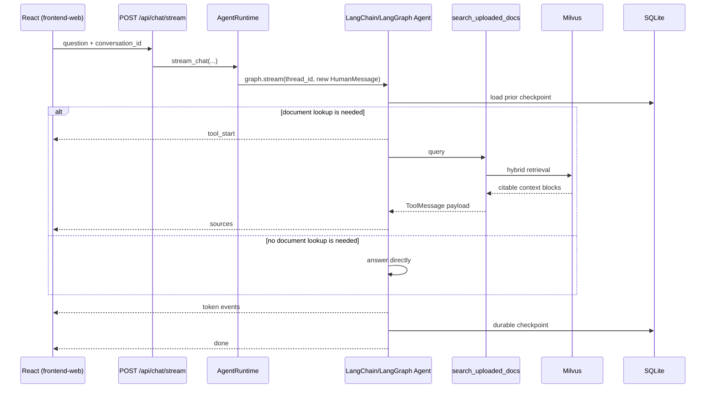

# Query Workflow (Persistent Single-Tool Agent)

> Part of the [System Architecture](architecture.md). PDF ingestion is documented separately in [pdf-upload-workflow.md](pdf-upload-workflow.md).

The normal chat path is a persistent LangChain Agent with exactly one tool: `search_uploaded_docs`. LangChain's `create_agent` builds the graph, LangGraph executes the model/tool cycle, and `SqliteSaver` persists each conversation. Application code does not implement its own Agent loop.

## 1. Request and Persistence Model

Every chat request includes:

```json
{
  "question": "What is the WiFi password?",
  "conversation_id": "5f4c72ca-09e5-4e8a-b73e-3c3ad5f20c88",
  "openai_api_key": null,
  "top_k": 5
}
```

`conversation_id` must be a UUID. The backend passes it unchanged as LangGraph's `thread_id`; therefore:

- requests with the same ID continue the same message history;
- different IDs are isolated;
- a refresh or backend restart restores history from SQLite;
- deleting a conversation removes both its catalog row and its LangGraph checkpoint state.

The frontend client creates the UUID for a new unsaved chat. The catalog row is created only after the first successful Agent turn, avoiding empty conversations in the sidebar.

## 2. Agent Turn



### Step 1: API-key selection

`backend/app/api/chat.py` uses a request-scoped key when supplied; otherwise it uses the server's `OPENAI_API_KEY`. A working key enables the persistent Agent path.

If no key exists, there is no model capable of running the Agent. The endpoint instead performs the existing retrieval/extractive fallback. On the streaming endpoint it emits a `notice` explaining that this fallback turn is stateless and is not written into conversation memory.

### Step 2: Runtime and thread configuration

FastAPI lifespan creates one `AgentRuntime` per backend process. It owns:

- a long-lived SQLite connection and LangGraph `SqliteSaver`;
- a separate connection for the `app_conversations` catalog;
- startup/setup and shutdown/close behavior.

For each turn, the runtime builds an Agent with the request's model credentials and tool context, then invokes it with:

```python
{
    "configurable": {"thread_id": conversation_id},
    "recursion_limit": 7,
}
```

The checkpointer automatically loads previous messages and appends the new turn. No application-owned `messages` table or manual prompt-history concatenation is used.

### Step 3: Framework-owned tool decision

`backend/app/agent/chat_agent.py::build_agent()` calls LangChain `create_agent` with the chat model, existing `search_uploaded_docs` tool, system prompt, and SQLite checkpointer.

The model may answer directly, call the tool once, or call it again for a multi-part question. LangGraph owns this sequence. The recursion limit bounds it to three tool rounds; exceeding the budget produces an explicit error instead of an unbounded loop.

### Step 4: Single retrieval tool

`backend/app/agent/tools.py` remains the sole Agent tool. It accepts a search query, calls the existing hybrid retrieval core, and returns structured content plus citations. It catches retrieval failures and returns a clean tool-level failure so one search error does not crash the graph.

The Agent has no upload, filesystem, SQL, or arbitrary execution tool.

### Step 5: Current-turn citations

For non-streaming calls, the runtime records the checkpoint message count before invocation and examines only newly produced messages afterward. Sources are parsed exclusively from successful new `ToolMessage` payloads and deduplicated.

For streaming calls, sources come from the current `tools` update events. This prevents a source used in an earlier turn from being presented as if it were retrieved again now. If the model answers without using the tool, the response has an empty source list.

### Step 6: Native streaming

The UI calls `POST /api/chat/stream`. The runtime consumes LangGraph's native `messages` and `updates` modes and converts them to newline-delimited JSON:

| Event | Meaning |
| --- | --- |
| `tool_start` | The model chose the tool; includes its search query. |
| `sources` | Citable results returned by the current tool call(s). |
| `token` | Incremental final-answer text. |
| `notice` | No-key fallback is active and the turn is not persisted. |
| `error` | Agent execution failed or exceeded its limit. |
| `done` | The turn and durable checkpoint completed. |

`POST /api/chat` runs the same persistent Agent synchronously and returns one `answer` plus `sources` object.

## 3. Hybrid Retrieval Core

Both the Agent tool and the no-key fallback reuse `backend/app/rag/hybrid_search.py`:

1. Dense semantic search and Milvus-native BM25 keyword search run independently.
2. Reciprocal Rank Fusion combines their ranks without comparing incompatible raw scores.
3. The strongest fused chunks become anchors.
4. Each anchor expands to its neighboring `chunk_seq` values.
5. Overlapping ranges merge into coherent context blocks.
6. Same-page chunk overlap is removed when text is stitched back together.
7. Each block receives document, page range, score, excerpt, and stable citation metadata.

This keeps retrieval and citation behavior identical whether it is reached through the Agent tool or the stateless fallback.

## 4. Conversation Management

LangGraph checkpoints are the source of truth for message state. A separate metadata-only table makes threads discoverable in the UI.

| Method | Endpoint | Behavior |
| --- | --- | --- |
| `GET` | `/api/conversations` | Lists saved conversations, newest activity first. |
| `GET` | `/api/conversations/{id}/messages` | Reconstructs display history from checkpoint messages and persisted tool results. |
| `PATCH` | `/api/conversations/{id}` | Renames the catalog entry. |
| `DELETE` | `/api/conversations/{id}` | Deletes catalog metadata and the complete LangGraph thread. |

The catalog stores only `id`, `title`, `created_at`, and `updated_at`. It intentionally does not duplicate user/assistant messages. The initial title is derived from the first successful question and can be renamed in the sidebar.

## 5. SQLite Lifecycle and Concurrency

The default file is `backend/data/chat_history.sqlite`, configurable through `CHAT_DB_PATH`. LangGraph owns its checkpoint tables; application tables use the `app_` prefix. Both SQLite connections enable WAL mode and a five-second busy timeout.

The runtime is created in FastAPI lifespan startup and closed at shutdown. It is not constructed at import time. Docker's existing `backend/data:/app/data` volume makes the default database durable across container recreation.

This design targets the current single-backend-process application. Before scaling to multiple workers or replicas, move checkpoints/catalog state to a shared production database or validate SQLite's locking and filesystem semantics for that deployment.

## 6. Frontend Behavior

On startup, the frontend loads the conversation catalog and restores the latest thread. The sidebar supports:

- New chat;
- selecting any saved conversation;
- renaming the selected conversation;
- deleting a conversation and selecting the next available thread.

During a turn, it renders tool-search status, sources, and answer tokens as events arrive. Local `session_state.messages` is only a render cache; persisted backend checkpoints remain the source of truth and repopulate it after reload or conversation switching.

## 7. Failure Semantics

- Invalid or missing `conversation_id`: request validation fails before Agent execution.
- Empty question: HTTP 400.
- Missing API key: stateless retrieval/extractive fallback; streaming response includes a notice.
- Invalid/expired API key: Agent event/error or HTTP 500, depending on endpoint.
- Tool/retrieval failure: returned to the model as a clean tool result.
- Agent recursion limit: clear limit response/error with no infinite execution.
- Unknown conversation history/rename: HTTP 404.
- Repeated delete: safe and idempotent; `deleted` indicates whether catalog metadata existed.
