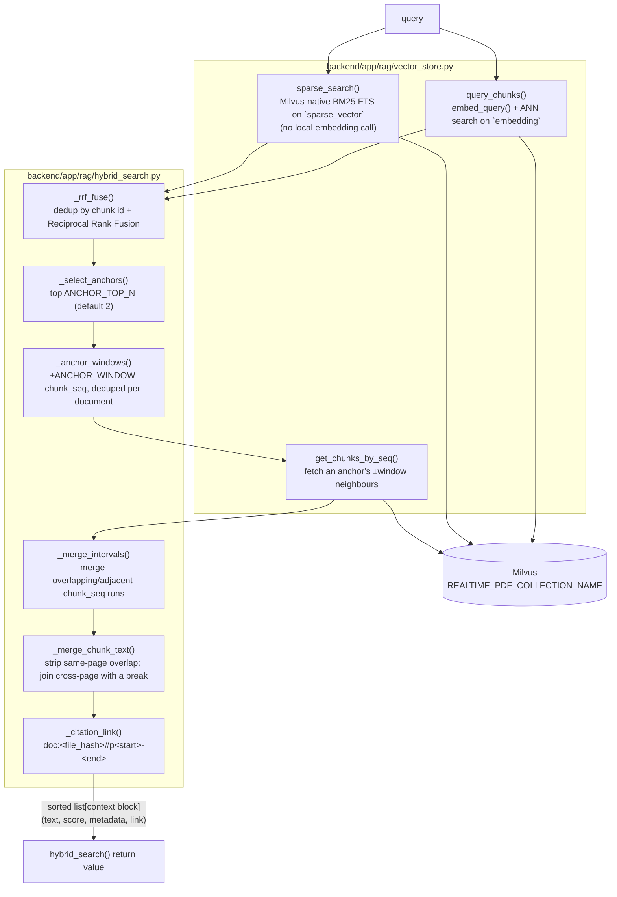
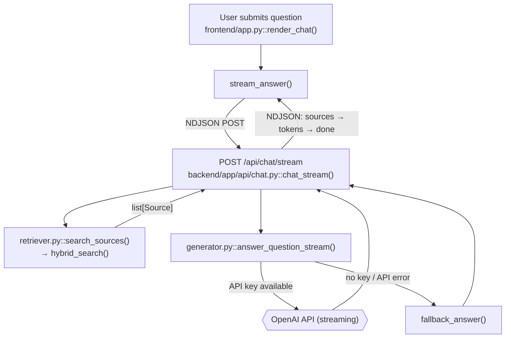
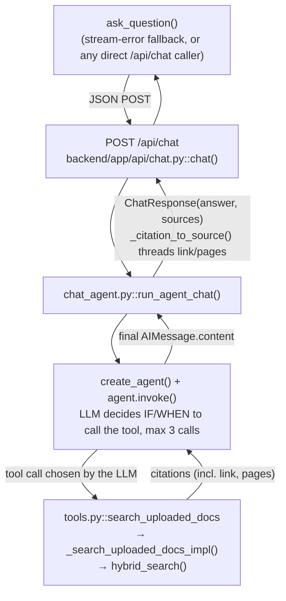

# Hybrid Query Retrieval Implementation Plan

> **For agentic workers:** REQUIRED SUB-SKILL: Use superpowers:subagent-driven-development (recommended) or superpowers:executing-plans to implement this plan task-by-task. Steps use checkbox (`- [ ]`) syntax for tracking.

**Goal:** Replace today's two retrieval paths (Path A: dense search → lexical-overlap `reranker.py`; Path B: dense search only, no reranking) with one shared hybrid pipeline — dense + Milvus-native BM25 search, RRF fusion, dedup by chunk id, anchor selection, ±1 `chunk_seq` context-window assembly, interval merge, same-page text-overlap stripping, and a citable link per block — used by both `retriever.py` (Path A) and `tools.py` (Path B).

**Architecture:** A new `backend/app/rag/hybrid_search.py` holds the whole pipeline: pure fusion/merge/anchor functions (no I/O) plus a `hybrid_search()` orchestrator that calls three `vector_store.py` primitives — the existing `query_chunks()` (dense, now also returning `chunk_seq`), a new `sparse_search()` (Milvus-native BM25 full-text search on the `sparse_vector` field added by the prior upload spec), and a new `get_chunks_by_seq()` (fetch an anchor's `chunk_seq` neighbours). `retriever.py` and `tools.py` both become thin adapters over `hybrid_search()`, mapping its context blocks into their own output shape (`Source` objects vs. tool citations). `reranker.py` is deleted — its purpose (rank fusion over dense + a second signal) is fully subsumed by real dense+BM25 RRF fusion.

**Tech Stack:** `pymilvus==2.6.3` against a live Milvus (confirmed running locally, `milvus-standalone` v2.6.6, `realtime_pdf_collection` already has the BM25 `sparse_vector` field and `chunk_seq` populated on 150 existing rows). No new dependencies.

**Spec:** `docs/superpowers/specs/2026-08-16-hybrid-query-retrieval-design.md`

## Global Constraints

- Both chat paths adopt the shared pipeline: Path A (`retriever.py` → `/api/chat/stream`) and Path B (`tools.py`'s `search_uploaded_docs` tool → `/api/chat`) both call `hybrid_search()`. Neither path keeps its old retrieval logic.
- `reranker.py` is deleted once nothing imports it. `RERANK_TOP_K` is removed from `config.py` at the same time (not before — `retriever.py`/`reranker.py` still reference it until that task).
- Sparse search uses Milvus's native BM25 full-text search (`client.search(anns_field="sparse_vector", data=[<raw query text>])`) — never a client-side BM25 library, never a manual embedding call for the sparse side.
- Dedup-by-`chunk.id` uses the Milvus auto-generated primary-key `id`, which is the same underlying value whether a chunk was found via `embedding` or `sparse_vector` search (same collection, same rows).
- Anchor windows are addressed by `chunk_seq` (document-global, crosses page boundaries), never by `chunk_index` (page-local, resets every page).
- Text-overlap stripping between two adjacent chunks only happens when they share the same `page`. Adjacent chunks on different pages are joined with a paragraph break and never overlap-stripped — `chunk_text()` runs per-page, so there is no shared substring to strip across a page boundary.
- Chunks with no `chunk_seq` in their metadata (pre-existing fixtures, or chunks indexed before the upload-spec change) must not crash `hybrid_search()` — they degrade to a single-chunk block built directly from the anchor. This keeps `scripts/test_chat_agent.py` and `scripts/test_search_uploaded_docs_tool.py`'s existing fixtures (which omit `chunk_seq`) passing unmodified.
- `search_uploaded_docs`'s LLM-visible tool schema is unchanged — still only `query`. `top_k`/`anchor_top_n`/`window` stay Python-side defaults.
- `UserContext` is still accepted but still unused for filtering — unchanged from today, not part of this plan's scope.
- `backend/app/orchestrator/` and `OFFLINE_DOCS_COLLECTION_NAME` are untouched — separate, still-unwired code per the 2026-08-06 orchestrator-move plan.
- All live-Milvus test scripts follow the existing convention in `scripts/`: override `REALTIME_PDF_COLLECTION_NAME` to a throwaway `test_*` collection, monkeypatch `app.rag.embeddings.embed_texts`/`embed_query` with a deterministic hash-based fake embedding (no model download), drop the test collection in a `finally` block, run with `backend/.venv/bin/python3 scripts/test_*.py`, exit 0/1.

---

## File Structure

```
00_RAG_Document_Chat/
├── backend/app/
│   ├── config.py                 # MODIFY: +SPARSE_TOP_K/ANCHOR_TOP_N/ANCHOR_WINDOW, -RERANK_TOP_K
│   ├── schemas.py                 # MODIFY: Source +pages, +link
│   ├── rag/
│   │   ├── vector_store.py        # MODIFY: query_chunks()+chunk_seq, +sparse_search(), +get_chunks_by_seq()
│   │   ├── hybrid_search.py       # NEW: fusion/merge/anchor pipeline + hybrid_search()
│   │   ├── retriever.py           # MODIFY: rewritten on top of hybrid_search()
│   │   ├── reranker.py            # DELETE
│   │   ├── evaluator.py           # MODIFY: _page_hit_score() checks the full page range
│   │   └── generator.py           # MODIFY: format_context()/fallback_answer() show page range + link
│   └── agent/
│       ├── tools.py               # MODIFY: _search_uploaded_docs_impl() calls hybrid_search()
│       └── chat_agent.py          # MODIFY: _citation_to_source() threads pages/link
├── frontend/app.py                # MODIFY: render_source_items() shows page range + link
├── scripts/
│   ├── test_hybrid_vector_store.py    # NEW (Task 1)
│   ├── test_hybrid_search_merge.py    # NEW (Task 2, pure — no Milvus)
│   ├── test_hybrid_search.py          # NEW (Task 3, live)
│   ├── test_retriever_hybrid.py       # NEW (Task 4, live)
│   ├── test_evaluator_page_hit.py     # NEW (Task 6, pure)
│   ├── test_generator_context_format.py # NEW (Task 6, pure)
│   └── test_rag_reranker.py           # DELETE (Task 4)
├── docs/architecture.md           # MODIFY: Section 3 rewritten (Task 7)
├── ARCHITECTURE.md                # MODIFY: reranker mentions replaced (Task 7)
└── README.md                      # MODIFY: reranker mentions replaced (Task 7)
```

---

### Task 1: `vector_store.py` — hybrid search primitives

**Files:**
- Modify: `backend/app/rag/vector_store.py:77-115` (`query_chunks()`)
- Create: `scripts/test_hybrid_vector_store.py`

**Interfaces:**
- Consumes: `get_collection()`, `embeddings.embed_query()` (both already in this file, unchanged).
- Produces: `query_chunks(query: str, top_k: int = 5) -> list[dict]` (same signature; `metadata` now also has `"chunk_seq"`), `sparse_search(query: str, top_k: int = 5) -> list[dict]` (same return shape as `query_chunks`), `get_chunks_by_seq(file_hash: str, chunk_seqs: list[int]) -> list[dict]` (flat rows: `id`/`text`/`document_name`/`file_hash`/`page`/`chunk_index`/`chunk_seq`). All three consumed by Task 3's `hybrid_search()`.

- [x] **Step 1: Write the failing test — `scripts/test_hybrid_vector_store.py`**

```python
#!/usr/bin/env python
"""Test vector_store.py's hybrid-search primitives: chunk_seq on dense search,
sparse_search() (BM25 FTS), and get_chunks_by_seq() (anchor window fetch)."""
from __future__ import annotations

import hashlib
import math
import os
import re
import sys
from pathlib import Path

_backend_dir = Path(__file__).resolve().parents[1] / "backend"
if str(_backend_dir) not in sys.path:
    sys.path.insert(0, str(_backend_dir))

_TEST_COLLECTION = "test_hybrid_vector_store_collection"
os.environ["REALTIME_PDF_COLLECTION_NAME"] = _TEST_COLLECTION

from app.rag import embeddings as embedding_module


def _test_embed(texts: list[str], dimensions: int = 384) -> list[list[float]]:
    vectors: list[list[float]] = []
    for text in texts:
        vector = [0.0] * dimensions
        for token in re.findall(r"\w+", text.lower()):
            digest = hashlib.sha256(token.encode("utf-8")).digest()
            index = int.from_bytes(digest[:4], "big") % dimensions
            vector[index] += 1.0
        norm = math.sqrt(sum(v * v for v in vector)) or 1.0
        vectors.append([v / norm for v in vector])
    return vectors


embedding_module.embed_texts = _test_embed
embedding_module.embed_query = lambda q: _test_embed([q])[0]

from app.rag.types import Chunk
from app.rag.vector_store import add_chunks, get_chunks_by_seq, get_collection, query_chunks, sparse_search


def test_hybrid_vector_store() -> bool:
    print("=" * 70)
    print("VECTOR_STORE HYBRID PRIMITIVES TEST")
    print("=" * 70)

    chunks = [
        Chunk(
            id="hash1:p1:c1",
            text="The onboarding checklist covers laptop setup and badge issuance.",
            metadata={"document_name": "onboarding.pdf", "file_hash": "hash1", "page": 1, "chunk_index": 1, "chunk_seq": 1},
        ),
        Chunk(
            id="hash1:p1:c2",
            text="Badge issuance requires photo ID verification at the front desk.",
            metadata={"document_name": "onboarding.pdf", "file_hash": "hash1", "page": 1, "chunk_index": 2, "chunk_seq": 2},
        ),
        Chunk(
            id="hash1:p2:c1",
            text="Parking permits are issued separately by facilities management.",
            metadata={"document_name": "onboarding.pdf", "file_hash": "hash1", "page": 2, "chunk_index": 1, "chunk_seq": 3},
        ),
    ]

    try:
        print("\n[1/4] Seeding 3 chunks...")
        added = add_chunks(chunks)
        assert added == 3, f"expected 3 chunks added, got {added}"
        print(f"   OK: added {added}")

        print("\n[2/4] query_chunks() (dense) now returns chunk_seq in metadata...")
        dense_results = query_chunks("laptop setup", top_k=3)
        assert dense_results, "expected at least one dense result"
        assert all("chunk_seq" in r["metadata"] for r in dense_results), f"expected chunk_seq on every hit: {dense_results}"
        top = next(r for r in dense_results if "laptop" in r["text"])
        assert top["metadata"]["chunk_seq"] == 1, f"expected chunk_seq=1 on the laptop chunk, got: {top}"
        print(f"   OK: {len(dense_results)} dense hits, all carry chunk_seq")

        print("\n[3/4] sparse_search() (BM25 FTS) finds a chunk by its distinguishing keyword...")
        sparse_results = sparse_search("parking", top_k=3)
        assert sparse_results, "expected at least one sparse result"
        assert sparse_results[0]["metadata"]["chunk_seq"] == 3, f"expected the parking chunk (chunk_seq=3) to rank first, got: {sparse_results[0]}"
        assert "Parking permits" in sparse_results[0]["text"]
        print(f"   OK: top sparse hit is chunk_seq=3: {sparse_results[0]['text'][:50]}...")

        print("\n[4/4] get_chunks_by_seq() fetches an anchor's neighbours by chunk_seq...")
        window = get_chunks_by_seq("hash1", [1, 2])
        assert len(window) == 2, f"expected 2 rows, got {window}"
        window.sort(key=lambda r: r["chunk_seq"])
        assert [r["chunk_seq"] for r in window] == [1, 2], f"expected chunk_seq [1, 2], got: {window}"
        assert window[0]["page"] == 1 and window[1]["page"] == 1
        assert "id" in window[0] and "text" in window[0]
        empty = get_chunks_by_seq("hash1", [])
        assert empty == [], f"expected [] for an empty chunk_seqs list, got {empty}"
        print(f"   OK: fetched chunk_seq=[1, 2], empty-input short-circuit works")

        print("\nPASSED: vector_store.py hybrid-search primitives work against Milvus.")
        return True

    except AssertionError as e:
        print(f"\nFAILED: {e}")
        return False

    finally:
        client = get_collection()
        if client.has_collection(_TEST_COLLECTION):
            client.drop_collection(_TEST_COLLECTION)
            print(f"\n[cleanup] dropped {_TEST_COLLECTION}")


if __name__ == "__main__":
    success = test_hybrid_vector_store()
    sys.exit(0 if success else 1)
```

- [x] **Step 2: Run it, confirm it fails**

```bash
cd /Users/baoshuangzhang/Desktop/Agentic_RAG/agentic_rag/00_RAG_Document_Chat
backend/.venv/bin/python3 scripts/test_hybrid_vector_store.py
```
Expected: `ImportError: cannot import name 'sparse_search'` (or `get_chunks_by_seq`) — neither exists yet.

- [x] **Step 3: Replace `backend/app/rag/vector_store.py:77-115`** (the current `query_chunks()` function only — everything above line 77 and `list_documents()` from line 118 onward are unchanged) with:

```python
_SEARCH_OUTPUT_FIELDS = ["text", "document_name", "file_hash", "page", "chunk_index", "chunk_seq"]


def _hits_from_search_results(results) -> list[dict]:
    """Flatten a Milvus search() response (list[list[hit]]) into the shared hit
    shape used by both dense (query_chunks) and sparse (sparse_search) search."""
    retrieved: list[dict] = []
    for hits in results:
        for hit in hits:
            entity = hit.get("entity", {})
            distance = hit.get("distance")
            retrieved.append(
                {
                    "id": hit.get("id"),
                    "text": entity.get("text"),
                    "metadata": {
                        "document_name": entity.get("document_name"),
                        "file_hash": entity.get("file_hash"),
                        "page": entity.get("page"),
                        "chunk_index": entity.get("chunk_index"),
                        "chunk_seq": entity.get("chunk_seq"),
                    },
                    "distance": float(distance) if distance is not None else None,
                    "score": float(distance) if distance is not None else 0.0,
                }
            )
    return retrieved


def query_chunks(query: str, top_k: int = 5) -> list[dict]:
    """Dense (embedding) search."""
    if not query.strip():
        raise ValueError("Query must not be empty.")

    client = get_collection()
    stats = client.get_collection_stats(REALTIME_PDF_COLLECTION_NAME)
    if int(stats.get("row_count", 0)) == 0:
        return []

    query_vector = embeddings.embed_query(query)
    results = client.search(
        collection_name=REALTIME_PDF_COLLECTION_NAME,
        data=[query_vector],
        anns_field="embedding",
        limit=top_k,
        output_fields=_SEARCH_OUTPUT_FIELDS,
    )
    return _hits_from_search_results(results)


def sparse_search(query: str, top_k: int = 5) -> list[dict]:
    """BM25 full-text search via Milvus's native `sparse_vector` Function field
    (see hybrid_schema.py). Milvus tokenizes and BM25-scores `query` itself —
    unlike query_chunks(), no local embedding call is made here."""
    if not query.strip():
        raise ValueError("Query must not be empty.")

    client = get_collection()
    stats = client.get_collection_stats(REALTIME_PDF_COLLECTION_NAME)
    if int(stats.get("row_count", 0)) == 0:
        return []

    results = client.search(
        collection_name=REALTIME_PDF_COLLECTION_NAME,
        data=[query],
        anns_field="sparse_vector",
        limit=top_k,
        output_fields=_SEARCH_OUTPUT_FIELDS,
    )
    return _hits_from_search_results(results)


def get_chunks_by_seq(file_hash: str, chunk_seqs: list[int]) -> list[dict]:
    """Fetch specific chunks of one document by chunk_seq — used to build an
    anchor's ±window context. Returns flat rows (same convention as
    indexed_file_hashes()/list_documents()), not the nested search() shape."""
    if not chunk_seqs:
        return []

    client = get_collection()
    seq_list = ",".join(str(seq) for seq in chunk_seqs)
    return client.query(
        collection_name=REALTIME_PDF_COLLECTION_NAME,
        filter=f'file_hash == "{file_hash}" && chunk_seq in [{seq_list}]',
        output_fields=["id", "text", "document_name", "file_hash", "page", "chunk_index", "chunk_seq"],
        limit=len(chunk_seqs),
    )
```

- [x] **Step 4: Run the test, confirm it passes**

```bash
cd /Users/baoshuangzhang/Desktop/Agentic_RAG/agentic_rag/00_RAG_Document_Chat
backend/.venv/bin/python3 scripts/test_hybrid_vector_store.py
```
Expected: `PASSED: vector_store.py hybrid-search primitives work against Milvus.`, exit 0.

- [x] **Step 5: Run the existing vector_store regression test**

```bash
cd /Users/baoshuangzhang/Desktop/Agentic_RAG/agentic_rag/00_RAG_Document_Chat
backend/.venv/bin/python3 scripts/test_vector_store_milvus.py
```
Expected: still `PASSED: vector_store.py works against Milvus.` — its own raw `client.search(anns_field="sparse_vector", ...)` calls are unaffected by this task, and `query_chunks()`'s new `chunk_seq` field is additive, not a breaking change to its existing assertions.

- [x] **Step 6: Commit**

```bash
cd /Users/baoshuangzhang/Desktop/Agentic_RAG/agentic_rag/00_RAG_Document_Chat
git add backend/app/rag/vector_store.py scripts/test_hybrid_vector_store.py
git commit -m "vector_store.py: add sparse_search() and get_chunks_by_seq(), chunk_seq on query_chunks()"
```

---

### Task 2: `hybrid_search.py` — pure fusion/merge/anchor functions

**Files:**
- Modify: `backend/app/config.py:20-21`
- Create: `backend/app/rag/hybrid_search.py`
- Create: `scripts/test_hybrid_search_merge.py`

**Interfaces:**
- Consumes: `app.config.CHUNK_OVERLAP` (existing).
- Produces (all pure, no I/O): `_rrf_fuse(dense_hits, sparse_hits) -> list[dict]`, `_select_anchors(fused, anchor_top_n) -> list[dict]`, `_anchor_windows(anchors, window) -> dict[str, set[int]]`, `_merge_intervals(rows) -> list[list[dict]]`, `_append_with_overlap_removed(prev_text, next_text, max_overlap) -> str`, `_merge_chunk_text(rows) -> str`, `_citation_link(file_hash, page_start, page_end) -> str`, `_build_block(rows, anchor_scores) -> dict`, `_anchor_to_row(anchor) -> dict`. Consumed by Task 3's `hybrid_search()` (same file) and exercised directly by this task's test.

- [x] **Step 1: Add new config vars — `backend/app/config.py`**

Replace lines 20-21:
```python
TOP_K = int(os.getenv("TOP_K", "5"))
RERANK_TOP_K = int(os.getenv("RERANK_TOP_K", "3"))
```
with:
```python
TOP_K = int(os.getenv("TOP_K", "5"))
RERANK_TOP_K = int(os.getenv("RERANK_TOP_K", "3"))
SPARSE_TOP_K = int(os.getenv("SPARSE_TOP_K", str(TOP_K)))
ANCHOR_TOP_N = int(os.getenv("ANCHOR_TOP_N", "2"))
ANCHOR_WINDOW = int(os.getenv("ANCHOR_WINDOW", "1"))
```
(`RERANK_TOP_K` stays for now — `reranker.py`/`retriever.py` still import it until Task 4.)

- [x] **Step 2: Write the failing test — `scripts/test_hybrid_search_merge.py`**

```python
#!/usr/bin/env python
"""Test hybrid_search.py's pure fusion/merge/anchor functions in isolation — no Milvus needed."""
from __future__ import annotations

import sys
from pathlib import Path

_backend_dir = Path(__file__).resolve().parents[1] / "backend"
if str(_backend_dir) not in sys.path:
    sys.path.insert(0, str(_backend_dir))

from app.rag.hybrid_search import (
    _anchor_to_row,
    _anchor_windows,
    _append_with_overlap_removed,
    _build_block,
    _citation_link,
    _merge_chunk_text,
    _merge_intervals,
    _rrf_fuse,
    _select_anchors,
)


def _hit(id_, text, file_hash, page, chunk_index, chunk_seq):
    return {
        "id": id_,
        "text": text,
        "metadata": {
            "document_name": "doc.pdf",
            "file_hash": file_hash,
            "page": page,
            "chunk_index": chunk_index,
            "chunk_seq": chunk_seq,
        },
    }


def test_hybrid_search_merge() -> bool:
    print("=" * 70)
    print("HYBRID_SEARCH PURE-FUNCTION TEST")
    print("=" * 70)

    try:
        print("\n[1/7] _rrf_fuse() dedups by id and fuses two ranked lists...")
        dense = [_hit(1, "a", "h1", 1, 1, 1), _hit(2, "b", "h1", 1, 2, 2)]
        sparse = [_hit(2, "b", "h1", 1, 2, 2), _hit(3, "c", "h1", 2, 1, 3)]
        fused = _rrf_fuse(dense, sparse)
        assert len(fused) == 3, f"expected 3 unique chunks (1,2,3), got {len(fused)}: {fused}"
        by_id = {e["id"]: e for e in fused}
        assert by_id[2]["dense_rank"] == 2 and by_id[2]["sparse_rank"] == 1, f"chunk 2 should carry both ranks: {by_id[2]}"
        assert by_id[1].get("sparse_rank") is None, "chunk 1 only came from dense"
        assert by_id[3].get("dense_rank") is None, "chunk 3 only came from sparse"
        assert fused[0]["id"] == 2, f"chunk 2 (in both lists) should score highest, got order: {[e['id'] for e in fused]}"
        print(f"   OK: 3 unique chunks, id=2 correctly carries both ranks and ranks first")

        print("\n[2/7] _select_anchors() takes the top N...")
        anchors = _select_anchors(fused, anchor_top_n=2)
        assert len(anchors) == 2
        print(f"   OK: {[a['id'] for a in anchors]}")

        print("\n[3/7] _anchor_windows() dedups overlapping ±1 windows across anchors...")
        anchors2 = [_hit(10, "x", "h1", 1, 1, 5), _hit(11, "y", "h1", 1, 2, 6)]
        needed = _anchor_windows(anchors2, window=1)
        assert needed == {"h1": {4, 5, 6, 7}}, f"expected union of {{4,5,6}} and {{5,6,7}}, got {needed}"
        print(f"   OK: {needed}")

        print("\n[4/7] _anchor_windows() never requests chunk_seq < 1...")
        edge = _anchor_windows([_hit(20, "z", "h1", 1, 1, 1)], window=1)
        assert edge == {"h1": {1, 2}}, f"expected {{1,2}} (0 excluded), got {edge}"
        print(f"   OK: {edge}")

        print("\n[5/7] _merge_intervals() splits non-adjacent runs, merges adjacent ones...")
        rows = [
            {"id": 1, "chunk_seq": 1}, {"id": 2, "chunk_seq": 2}, {"id": 3, "chunk_seq": 3},
            {"id": 4, "chunk_seq": 9}, {"id": 5, "chunk_seq": 10},
        ]
        blocks = _merge_intervals(rows)
        assert [[r["id"] for r in b] for b in blocks] == [[1, 2, 3], [4, 5]], f"got {blocks}"
        print(f"   OK: {[[r['id'] for r in b] for b in blocks]}")

        print("\n[6/7] Text merge: same-page overlap stripped once, cross-page not stripped...")
        prev = "the quarterly report covers revenue growth and cost containment measures"
        overlap = prev[-30:]
        next_same_page = overlap + " plus a forward-looking outlook section"
        merged = _append_with_overlap_removed(prev, next_same_page, max_overlap=180)
        assert merged == prev + " plus a forward-looking outlook section", f"expected overlap stripped, got: {merged!r}"

        rows_text = [
            {"text": prev, "page": 1},
            {"text": next_same_page, "page": 1},
            {"text": "Unrelated page-two heading with no shared text.", "page": 2},
        ]
        full = _merge_chunk_text(rows_text)
        assert full.count(overlap) == 1, f"same-page overlap must be stripped to one occurrence: {full!r}"
        assert "\n\n" in full, "expected a paragraph break between the page-1 and page-2 chunks"
        assert full.endswith("Unrelated page-two heading with no shared text."), f"got: {full!r}"

        no_overlap = _append_with_overlap_removed("first sentence.", "second sentence.", max_overlap=180)
        assert no_overlap == "first sentence. second sentence.", f"expected plain join fallback, got: {no_overlap!r}"
        print("   OK: same-page overlap stripped once, cross-page joined with a break and left intact, no-overlap case falls back to a plain join")

        print("\n[7/7] _citation_link() and _build_block() / _anchor_to_row() end to end...")
        assert _citation_link("h1", 3, 3) == "doc:h1#p3"
        assert _citation_link("h1", 3, 5) == "doc:h1#p3-5"

        context_rows = [
            {"id": 1, "text": "Alpha.", "document_name": "doc.pdf", "file_hash": "h1", "page": 1, "chunk_index": 1, "chunk_seq": 4},
            {"id": 2, "text": "Beta.", "document_name": "doc.pdf", "file_hash": "h1", "page": 1, "chunk_index": 2, "chunk_seq": 5},
        ]
        block = _build_block(context_rows, anchor_scores={1: 0.03})
        assert block["id"] == "h1:seq4-5"
        assert block["text"] == "Alpha. Beta."
        assert block["score"] == 0.03
        assert block["metadata"]["page_start"] == 1 and block["metadata"]["page_end"] == 1
        assert block["metadata"]["chunk_seq_start"] == 4 and block["metadata"]["chunk_seq_end"] == 5
        assert block["link"] == "doc:h1#p1"

        bare_anchor = _hit(99, "Standalone.", "h2", 7, 1, None)
        bare_row = _anchor_to_row(bare_anchor)
        assert bare_row["chunk_seq"] is None
        bare_block = _build_block([bare_row], anchor_scores={99: 0.01})
        assert bare_block["id"] == "h2:p7:c1", f"expected chunk_index-based id fallback, got {bare_block['id']}"
        assert bare_block["metadata"]["chunk_seq_start"] is None
        assert bare_block["link"] == "doc:h2#p7"
        print(f"   OK: {block['id']}, {bare_block['id']}")

        print("\nPASSED: hybrid_search.py pure functions behave correctly in isolation.")
        return True

    except AssertionError as e:
        print(f"\nFAILED: {e}")
        return False


if __name__ == "__main__":
    success = test_hybrid_search_merge()
    sys.exit(0 if success else 1)
```

- [x] **Step 3: Run it, confirm it fails**

```bash
cd /Users/baoshuangzhang/Desktop/Agentic_RAG/agentic_rag/00_RAG_Document_Chat
backend/.venv/bin/python3 scripts/test_hybrid_search_merge.py
```
Expected: `ModuleNotFoundError: No module named 'app.rag.hybrid_search'`.

- [x] **Step 4: Create `backend/app/rag/hybrid_search.py`**

```python
from __future__ import annotations

from typing import Any

from app.config import CHUNK_OVERLAP

RRF_K = 60
_MIN_TEXT_OVERLAP_CHARS = 20


def _rrf_fuse(dense_hits: list[dict[str, Any]], sparse_hits: list[dict[str, Any]]) -> list[dict[str, Any]]:
    """Merge dense + sparse hit lists, dedup by chunk id, score with Reciprocal Rank Fusion."""
    by_id: dict[Any, dict[str, Any]] = {}

    for rank, hit in enumerate(dense_hits, start=1):
        entry = by_id.setdefault(hit["id"], dict(hit))
        entry["dense_rank"] = rank

    for rank, hit in enumerate(sparse_hits, start=1):
        entry = by_id.setdefault(hit["id"], dict(hit))
        entry["sparse_rank"] = rank

    fused: list[dict[str, Any]] = []
    for entry in by_id.values():
        score = 0.0
        if entry.get("dense_rank") is not None:
            score += 1.0 / (RRF_K + entry["dense_rank"])
        if entry.get("sparse_rank") is not None:
            score += 1.0 / (RRF_K + entry["sparse_rank"])
        entry["rrf_score"] = score
        fused.append(entry)

    fused.sort(key=lambda e: e["rrf_score"], reverse=True)
    return fused


def _select_anchors(fused: list[dict[str, Any]], anchor_top_n: int) -> list[dict[str, Any]]:
    return fused[:anchor_top_n]


def _anchor_windows(anchors: list[dict[str, Any]], window: int) -> dict[str, set[int]]:
    """Per document, the set of chunk_seq values needed to build every anchor's
    ±window view. Only anchors that carry a chunk_seq should be passed in —
    hybrid_search() filters those out first."""
    needed: dict[str, set[int]] = {}
    for anchor in anchors:
        metadata = anchor["metadata"]
        file_hash = metadata["file_hash"]
        anchor_seq = metadata["chunk_seq"]
        seqs = needed.setdefault(file_hash, set())
        for offset in range(-window, window + 1):
            seq = anchor_seq + offset
            if seq >= 1:
                seqs.add(seq)
    return needed


def _merge_intervals(rows: list[dict[str, Any]]) -> list[list[dict[str, Any]]]:
    """Group chunk_seq-sorted rows of one document into contiguous runs — two
    rows merge into the same block when their chunk_seq differ by 1 or less."""
    if not rows:
        return []

    blocks: list[list[dict[str, Any]]] = [[rows[0]]]
    for row in rows[1:]:
        if row["chunk_seq"] - blocks[-1][-1]["chunk_seq"] <= 1:
            blocks[-1].append(row)
        else:
            blocks.append([row])
    return blocks


def _append_with_overlap_removed(prev_text: str, next_text: str, max_overlap: int = CHUNK_OVERLAP) -> str:
    """Strip the duplicated substring chunk_text() leaves between two adjacent
    same-page chunks (up to max_overlap characters) before concatenating. Falls
    back to a plain space-joined concatenation when no real overlap is found."""
    search_len = min(max_overlap, len(prev_text), len(next_text))
    for size in range(search_len, _MIN_TEXT_OVERLAP_CHARS - 1, -1):
        if prev_text[-size:] == next_text[:size]:
            return prev_text + next_text[size:]
    return f"{prev_text} {next_text}"


def _merge_chunk_text(rows: list[dict[str, Any]]) -> str:
    """Concatenate a contiguous run of chunks into one block's text. Adjacent
    chunks that share a page get overlap-stripped; adjacent chunks on
    different pages are joined with a paragraph break and never overlap-
    stripped, since chunk_text() runs per-page and leaves no shared substring
    across a page boundary."""
    merged = rows[0]["text"]
    for previous, current in zip(rows, rows[1:]):
        if previous["page"] == current["page"]:
            merged = _append_with_overlap_removed(merged, current["text"])
        else:
            merged = f"{merged}\n\n{current['text']}"
    return merged


def _citation_link(file_hash: str, page_start: int | None, page_end: int | None) -> str:
    """The reference handed back to the agent/user to point at the exact source
    span — same idea as session_search_tool.py's _session_link(), resolving to
    a document + page range instead of a chat session."""
    if page_start is None:
        return f"doc:{file_hash}"
    if page_start == page_end:
        return f"doc:{file_hash}#p{page_start}"
    return f"doc:{file_hash}#p{page_start}-{page_end}"


def _build_block(rows: list[dict[str, Any]], anchor_scores: dict[Any, float]) -> dict[str, Any]:
    """Assemble one final context block from a contiguous run of chunk rows."""
    pages = sorted({row["page"] for row in rows if row.get("page") is not None})
    chunk_indexes = [row["chunk_index"] for row in rows]
    chunk_seqs = [row["chunk_seq"] for row in rows if row.get("chunk_seq") is not None]
    document_name = rows[0]["document_name"]
    file_hash = rows[0]["file_hash"]
    page_start = pages[0] if pages else None
    page_end = pages[-1] if pages else None
    chunk_seq_start = chunk_seqs[0] if chunk_seqs else None
    chunk_seq_end = chunk_seqs[-1] if chunk_seqs else None

    block_score = max(
        (anchor_scores[row["id"]] for row in rows if row["id"] in anchor_scores),
        default=0.0,
    )
    block_id = (
        f"{file_hash}:seq{chunk_seq_start}-{chunk_seq_end}"
        if chunk_seq_start is not None
        else f"{file_hash}:p{page_start}:c{rows[0].get('chunk_index')}"
    )

    return {
        "id": block_id,
        "text": _merge_chunk_text(rows),
        "score": block_score,
        "metadata": {
            "document_name": document_name,
            "file_hash": file_hash,
            "page_start": page_start,
            "page_end": page_end,
            "pages": pages,
            "chunk_seq_start": chunk_seq_start,
            "chunk_seq_end": chunk_seq_end,
            "chunk_indexes": chunk_indexes,
        },
        "link": _citation_link(file_hash, page_start, page_end),
    }


def _anchor_to_row(anchor: dict[str, Any]) -> dict[str, Any]:
    """Adapt a nested search-hit (id/text/metadata{...}) into the flat row shape
    _build_block() expects — used for anchors with no chunk_seq: no window can
    be built, so the anchor becomes its own single-chunk block."""
    metadata = anchor.get("metadata", {})
    return {
        "id": anchor.get("id"),
        "text": anchor.get("text"),
        "document_name": metadata.get("document_name"),
        "file_hash": metadata.get("file_hash"),
        "page": metadata.get("page"),
        "chunk_index": metadata.get("chunk_index"),
        "chunk_seq": metadata.get("chunk_seq"),
    }
```

- [x] **Step 5: Run the test, confirm it passes**

```bash
cd /Users/baoshuangzhang/Desktop/Agentic_RAG/agentic_rag/00_RAG_Document_Chat
backend/.venv/bin/python3 scripts/test_hybrid_search_merge.py
```
Expected: `PASSED: hybrid_search.py pure functions behave correctly in isolation.`, exit 0. No live Milvus needed for this step.

- [x] **Step 6: Commit**

```bash
cd /Users/baoshuangzhang/Desktop/Agentic_RAG/agentic_rag/00_RAG_Document_Chat
git add backend/app/config.py backend/app/rag/hybrid_search.py scripts/test_hybrid_search_merge.py
git commit -m "Add hybrid_search.py: RRF fusion, dedup, anchor-window, interval-merge, and overlap-strip pure functions"
```

---

### Task 3: `hybrid_search.py::hybrid_search()` — top-level orchestrator

**Files:**
- Modify: `backend/app/rag/hybrid_search.py` (append)
- Create: `scripts/test_hybrid_search.py`

**Interfaces:**
- Consumes: `query_chunks`, `sparse_search`, `get_chunks_by_seq` (Task 1); `_rrf_fuse`, `_select_anchors`, `_anchor_windows`, `_merge_intervals`, `_build_block`, `_anchor_to_row` (Task 2); `ANCHOR_TOP_N`, `ANCHOR_WINDOW`, `SPARSE_TOP_K`, `TOP_K` (`app.config`).
- Produces: `hybrid_search(query: str, dense_top_k: int = TOP_K, sparse_top_k: int = SPARSE_TOP_K, anchor_top_n: int = ANCHOR_TOP_N, window: int = ANCHOR_WINDOW) -> list[dict]` — a list of context blocks (same shape `_build_block` produces), sorted by `(file_hash, chunk_seq_start)`. Consumed by Task 4 (`retriever.py`) and Task 5 (`tools.py`).

- [x] **Step 1: Write the failing test — `scripts/test_hybrid_search.py`**

```python
#!/usr/bin/env python
"""Test hybrid_search.py::hybrid_search() end to end against live Milvus: dense+BM25
fusion, anchor selection, ±1 chunk_seq window fetch, interval merge, same-page
overlap stripping, cross-page no-strip, and citation links."""
from __future__ import annotations

import hashlib
import math
import os
import re
import sys
from pathlib import Path

_backend_dir = Path(__file__).resolve().parents[1] / "backend"
if str(_backend_dir) not in sys.path:
    sys.path.insert(0, str(_backend_dir))

_TEST_COLLECTION = "test_hybrid_search_collection"
os.environ["REALTIME_PDF_COLLECTION_NAME"] = _TEST_COLLECTION

from app.rag import embeddings as embedding_module


def _test_embed(texts: list[str], dimensions: int = 384) -> list[list[float]]:
    vectors: list[list[float]] = []
    for text in texts:
        vector = [0.0] * dimensions
        for token in re.findall(r"\w+", text.lower()):
            digest = hashlib.sha256(token.encode("utf-8")).digest()
            index = int.from_bytes(digest[:4], "big") % dimensions
            vector[index] += 1.0
        norm = math.sqrt(sum(v * v for v in vector)) or 1.0
        vectors.append([v / norm for v in vector])
    return vectors


embedding_module.embed_texts = _test_embed
embedding_module.embed_query = lambda q: _test_embed([q])[0]

from app.rag.hybrid_search import hybrid_search
from app.rag.types import Chunk
from app.rag.vector_store import add_chunks, get_collection

_OVERLAP_PHRASE = "trailing context marker phrase"


def test_hybrid_search() -> bool:
    print("=" * 70)
    print("HYBRID_SEARCH END-TO-END TEST")
    print("=" * 70)

    try:
        print("\n[1/4] hybrid_search() on an empty collection returns []...")
        cold = hybrid_search("anything", anchor_top_n=1)
        assert cold == [], f"expected [] on an empty collection, got {cold}"
        print("   OK")

        print("\n[2/4] Seeding a 3-chunk document (2 same-page + 1 cross-page) and a 1-chunk other document...")
        chunks = [
            Chunk(
                id="hash_a:p1:c1",
                text=f"Alpha section about gemstone sourcing ethics and mining audits {_OVERLAP_PHRASE}",
                metadata={"document_name": "doc_a.pdf", "file_hash": "hash_a", "page": 1, "chunk_index": 1, "chunk_seq": 1},
            ),
            Chunk(
                id="hash_a:p1:c2",
                text=f"{_OVERLAP_PHRASE} introduces the vermilion pigment grading section on the same page",
                metadata={"document_name": "doc_a.pdf", "file_hash": "hash_a", "page": 1, "chunk_index": 2, "chunk_seq": 2},
            ),
            Chunk(
                id="hash_a:p2:c1",
                text="Gamma section on page two about export tariffs and customs classification.",
                metadata={"document_name": "doc_a.pdf", "file_hash": "hash_a", "page": 2, "chunk_index": 1, "chunk_seq": 3},
            ),
            Chunk(
                id="hash_b:p1:c1",
                text="An entirely unrelated giraffe habitat brochure page.",
                metadata={"document_name": "doc_b.pdf", "file_hash": "hash_b", "page": 1, "chunk_index": 1, "chunk_seq": 1},
            ),
        ]
        added = add_chunks(chunks)
        assert added == 4, f"expected 4 chunks added, got {added}"
        print(f"   OK: added {added}")

        print("\n[3/4] Anchor in the middle of doc_a: window merges all 3 chunks, same-page overlap stripped once, cross-page break not stripped...")
        blocks = hybrid_search("vermilion", anchor_top_n=1, window=1)
        assert len(blocks) == 1, f"expected exactly 1 block, got {len(blocks)}: {blocks}"
        block = blocks[0]
        assert block["metadata"]["file_hash"] == "hash_a"
        assert block["metadata"]["page_start"] == 1 and block["metadata"]["page_end"] == 2
        assert block["metadata"]["chunk_seq_start"] == 1 and block["metadata"]["chunk_seq_end"] == 3
        assert block["text"].count(_OVERLAP_PHRASE) == 1, f"expected the same-page overlap stripped to one occurrence, got: {block['text']!r}"
        assert "\n\n" in block["text"], "expected a paragraph break between the page-1 and page-2 content"
        assert block["text"].rstrip().endswith("customs classification."), f"expected page-two text intact at the end, got: {block['text']!r}"
        assert block["link"] == "doc:hash_a#p1-2", f"got {block['link']!r}"
        print(f"   OK: 1 block, pages 1-2, chunk_seq 1-3, overlap stripped once, link={block['link']!r}")

        print("\n[4/4] A query unique to the other document returns a separate, single-chunk block...")
        blocks_b = hybrid_search("giraffe", anchor_top_n=1, window=1)
        assert len(blocks_b) == 1, f"expected exactly 1 block, got {len(blocks_b)}: {blocks_b}"
        block_b = blocks_b[0]
        assert block_b["metadata"]["file_hash"] == "hash_b"
        assert block_b["metadata"]["page_start"] == 1 and block_b["metadata"]["page_end"] == 1
        assert block_b["metadata"]["chunk_seq_start"] == 1 and block_b["metadata"]["chunk_seq_end"] == 1
        assert "giraffe" in block_b["text"]
        assert block_b["link"] == "doc:hash_b#p1", f"got {block_b['link']!r}"
        print(f"   OK: 1 separate block for doc_b, link={block_b['link']!r}")

        print("\nPASSED: hybrid_search() fuses, dedups, expands, merges, and links correctly end to end.")
        return True

    except AssertionError as e:
        print(f"\nFAILED: {e}")
        return False

    finally:
        client = get_collection()
        if client.has_collection(_TEST_COLLECTION):
            client.drop_collection(_TEST_COLLECTION)
            print(f"\n[cleanup] dropped {_TEST_COLLECTION}")


if __name__ == "__main__":
    success = test_hybrid_search()
    sys.exit(0 if success else 1)
```

- [x] **Step 2: Run it, confirm it fails**

```bash
cd /Users/baoshuangzhang/Desktop/Agentic_RAG/agentic_rag/00_RAG_Document_Chat
backend/.venv/bin/python3 scripts/test_hybrid_search.py
```
Expected: `ImportError: cannot import name 'hybrid_search'` — the orchestrator doesn't exist yet, only the pure helpers from Task 2.

- [x] **Step 3: Append to `backend/app/rag/hybrid_search.py`**

Add this import at the top, alongside the existing `from app.config import CHUNK_OVERLAP` line:
```python
from app.config import ANCHOR_TOP_N, ANCHOR_WINDOW, CHUNK_OVERLAP, SPARSE_TOP_K, TOP_K
from app.rag.vector_store import get_chunks_by_seq, query_chunks, sparse_search
```

Append at the end of the file:
```python
def _fetch_context_chunks(needed: dict[str, set[int]]) -> dict[str, list[dict[str, Any]]]:
    """For each document, fetch the needed chunks and sort them by chunk_seq."""
    chunks_by_doc: dict[str, list[dict[str, Any]]] = {}
    for file_hash, seqs in needed.items():
        rows = get_chunks_by_seq(file_hash, sorted(seqs))
        rows.sort(key=lambda r: r["chunk_seq"])
        chunks_by_doc[file_hash] = rows
    return chunks_by_doc


def hybrid_search(
    query: str,
    dense_top_k: int = TOP_K,
    sparse_top_k: int = SPARSE_TOP_K,
    anchor_top_n: int = ANCHOR_TOP_N,
    window: int = ANCHOR_WINDOW,
) -> list[dict[str, Any]]:
    """Dense + BM25 hybrid retrieval, RRF-fused, expanded into anchor-centered
    context blocks. See docs/superpowers/specs/2026-08-16-hybrid-query-retrieval-design.md."""
    if not query.strip():
        raise ValueError("Query must not be empty.")

    dense_hits = query_chunks(query, top_k=dense_top_k)
    sparse_hits = sparse_search(query, top_k=sparse_top_k)
    fused = _rrf_fuse(dense_hits, sparse_hits)
    anchors = _select_anchors(fused, anchor_top_n)
    if not anchors:
        return []

    anchor_scores = {anchor["id"]: anchor["rrf_score"] for anchor in anchors}

    # Anchors that carry a chunk_seq get their ±window neighbours fetched and
    # merged; anchors with no chunk_seq degrade to a single-chunk block built
    # directly from the anchor (see spec §8).
    seq_anchors = [a for a in anchors if a["metadata"].get("chunk_seq") is not None]
    bare_anchors = [a for a in anchors if a["metadata"].get("chunk_seq") is None]

    needed = _anchor_windows(seq_anchors, window)
    chunks_by_doc = _fetch_context_chunks(needed)

    blocks: list[dict[str, Any]] = []
    for rows in chunks_by_doc.values():
        for run in _merge_intervals(rows):
            blocks.append(_build_block(run, anchor_scores))

    for anchor in bare_anchors:
        blocks.append(_build_block([_anchor_to_row(anchor)], anchor_scores))

    blocks.sort(key=lambda b: (b["metadata"]["file_hash"], b["metadata"]["chunk_seq_start"] or 0))
    return blocks
```

- [x] **Step 4: Run the test, confirm it passes**

```bash
cd /Users/baoshuangzhang/Desktop/Agentic_RAG/agentic_rag/00_RAG_Document_Chat
backend/.venv/bin/python3 scripts/test_hybrid_search.py
```
Expected: `PASSED: hybrid_search() fuses, dedups, expands, merges, and links correctly end to end.`, exit 0.

- [x] **Step 5: Re-run Task 2's pure test to confirm no regression**

```bash
cd /Users/baoshuangzhang/Desktop/Agentic_RAG/agentic_rag/00_RAG_Document_Chat
backend/.venv/bin/python3 scripts/test_hybrid_search_merge.py
```
Expected: still passes — the new imports/orchestrator appended in Step 3 don't change any of the pure functions Task 2 tests.

- [x] **Step 6: Commit**

```bash
cd /Users/baoshuangzhang/Desktop/Agentic_RAG/agentic_rag/00_RAG_Document_Chat
git add backend/app/rag/hybrid_search.py scripts/test_hybrid_search.py
git commit -m "Add hybrid_search() orchestrator: dense+BM25 search, fusion, anchor-window fetch, block assembly"
```

---

### Task 4: `retriever.py` (Path A) on `hybrid_search()`; `Source` gains `pages`/`link`; delete `reranker.py`

**Files:**
- Modify: `backend/app/schemas.py:6-11` (`Source`)
- Modify: `backend/app/rag/retriever.py` (full rewrite)
- Modify: `backend/app/config.py` (remove `RERANK_TOP_K`)
- Delete: `backend/app/rag/reranker.py`
- Delete: `scripts/test_rag_reranker.py`
- Create: `scripts/test_retriever_hybrid.py`

**Interfaces:**
- Consumes: `hybrid_search()` (Task 3).
- Produces: `retrieve_chunks(query: str, top_k: int = TOP_K) -> list[dict]` (now returns context blocks, not raw chunks), `search_sources(question: str, top_k: int = TOP_K) -> list[Source]` — same public names/signature as today minus the removed `rerank_top_k` parameter. Consumed by `backend/app/api/chat.py::chat_stream()` (already calls `search_sources(question=..., top_k=...)`, no change needed there) and `backend/app/api/evaluation.py` (already calls `search_sources(test_case["question"])`, no change needed there).

- [x] **Step 1: Extend `Source` — `backend/app/schemas.py:6-11`**

Replace:
```python
class Source(BaseModel):
    text: str
    document: str
    page: int | str
    chunk: int | str
    score: float | None = None
```
with:
```python
class Source(BaseModel):
    text: str
    document: str
    page: int | str
    chunk: int | str
    score: float | None = None
    pages: list[int] | None = None
    link: str | None = None
```

- [x] **Step 2: Write the failing test — `scripts/test_retriever_hybrid.py`**

```python
#!/usr/bin/env python
"""Test retriever.py: search_sources() maps hybrid_search() blocks into Source objects."""
from __future__ import annotations

import hashlib
import math
import os
import re
import sys
from pathlib import Path

_backend_dir = Path(__file__).resolve().parents[1] / "backend"
if str(_backend_dir) not in sys.path:
    sys.path.insert(0, str(_backend_dir))

_TEST_COLLECTION = "test_retriever_hybrid_collection"
os.environ["REALTIME_PDF_COLLECTION_NAME"] = _TEST_COLLECTION

from app.rag import embeddings as embedding_module


def _test_embed(texts: list[str], dimensions: int = 384) -> list[list[float]]:
    vectors: list[list[float]] = []
    for text in texts:
        vector = [0.0] * dimensions
        for token in re.findall(r"\w+", text.lower()):
            digest = hashlib.sha256(token.encode("utf-8")).digest()
            index = int.from_bytes(digest[:4], "big") % dimensions
            vector[index] += 1.0
        norm = math.sqrt(sum(v * v for v in vector)) or 1.0
        vectors.append([v / norm for v in vector])
    return vectors


embedding_module.embed_texts = _test_embed
embedding_module.embed_query = lambda q: _test_embed([q])[0]

from app.rag.retriever import search_sources
from app.rag.types import Chunk
from app.rag.vector_store import add_chunks, get_collection


def test_retriever_hybrid() -> bool:
    print("=" * 70)
    print("RETRIEVER (Path A) HYBRID SEARCH TEST")
    print("=" * 70)

    chunks = [
        Chunk(
            id="hash1:p1:c1",
            text="Section about firmware rollback overlap sentence marker here",
            metadata={"document_name": "manual.pdf", "file_hash": "hash1", "page": 1, "chunk_index": 1, "chunk_seq": 1},
        ),
        Chunk(
            id="hash1:p1:c2",
            text="overlap sentence marker here continues describing quartzite calibration steps",
            metadata={"document_name": "manual.pdf", "file_hash": "hash1", "page": 1, "chunk_index": 2, "chunk_seq": 2},
        ),
    ]

    try:
        print("\n[1/2] Seeding 2 same-page chunks...")
        added = add_chunks(chunks)
        assert added == 2, f"expected 2 chunks added, got {added}"
        print(f"   OK: added {added}")

        print("\n[2/2] search_sources() returns a Source with merged text, pages, chunk range, and link...")
        sources = search_sources("quartzite calibration", top_k=5)
        assert len(sources) >= 1, f"expected at least one source, got {sources}"
        source = sources[0]
        assert source.document == "manual.pdf"
        assert source.page == 1
        assert source.pages == [1]
        assert source.chunk == "1-2", f"expected merged chunk_seq range '1-2', got {source.chunk!r}"
        assert source.link == "doc:hash1#p1", f"got {source.link!r}"
        assert "overlap sentence marker here" in source.text
        assert source.text.count("overlap sentence marker here") == 1, f"expected the shared overlap stripped, got: {source.text!r}"
        assert source.score is not None
        print(f"   OK: document={source.document!r} pages={source.pages} chunk={source.chunk!r} link={source.link!r}")

        print("\nPASSED: retriever.py's search_sources() correctly maps hybrid_search() blocks to Source objects.")
        return True

    except AssertionError as e:
        print(f"\nFAILED: {e}")
        return False

    finally:
        client = get_collection()
        if client.has_collection(_TEST_COLLECTION):
            client.drop_collection(_TEST_COLLECTION)
            print(f"\n[cleanup] dropped {_TEST_COLLECTION}")


if __name__ == "__main__":
    success = test_retriever_hybrid()
    sys.exit(0 if success else 1)
```

- [x] **Step 3: Run it, confirm it fails**

```bash
cd /Users/baoshuangzhang/Desktop/Agentic_RAG/agentic_rag/00_RAG_Document_Chat
backend/.venv/bin/python3 scripts/test_retriever_hybrid.py
```
Expected: fails on `source.pages`/`source.link` or on the merged-text assertion — `retriever.py` still calls the old dense+`reranker.py` path, which doesn't merge chunks or set these fields.

- [x] **Step 4: Replace `backend/app/rag/retriever.py` in full**

```python
from __future__ import annotations

from app.config import TOP_K
from app.rag.hybrid_search import hybrid_search
from app.schemas import Source


def retrieve_chunks(query: str, top_k: int = TOP_K) -> list[dict]:
    """
    Hybrid (dense + BM25) retrieval, RRF-fused, expanded into anchor-centered
    context blocks. See app.rag.hybrid_search.hybrid_search() and
    docs/superpowers/specs/2026-08-16-hybrid-query-retrieval-design.md.

    Args:
        query: User query string.
        top_k: Candidate breadth for both the dense and sparse searches.

    Returns:
        List of context blocks (not raw chunks) with metadata, text, and score.
    """
    return hybrid_search(query, dense_top_k=top_k, sparse_top_k=top_k)


def search_sources(question: str, top_k: int = TOP_K) -> list[Source]:
    """
    Search and return sources for the chat response.
    """
    blocks = retrieve_chunks(question, top_k=top_k)

    sources: list[Source] = []
    for block in blocks:
        metadata = block.get("metadata", {})
        sources.append(
            Source(
                text=block.get("text", ""),
                document=metadata.get("document_name", "Unknown"),
                page=metadata.get("page_start", "?"),
                pages=metadata.get("pages") or None,
                chunk=_chunk_label(metadata),
                score=block.get("score"),
                link=block.get("link"),
            )
        )

    return sources


def _chunk_label(metadata: dict) -> int | str:
    start = metadata.get("chunk_seq_start")
    end = metadata.get("chunk_seq_end")
    if start is None:
        indexes = metadata.get("chunk_indexes") or []
        return indexes[0] if indexes else "?"
    return start if start == end else f"{start}-{end}"
```

- [x] **Step 5: Remove `RERANK_TOP_K` from `backend/app/config.py`**

Replace:
```python
TOP_K = int(os.getenv("TOP_K", "5"))
RERANK_TOP_K = int(os.getenv("RERANK_TOP_K", "3"))
SPARSE_TOP_K = int(os.getenv("SPARSE_TOP_K", str(TOP_K)))
```
with:
```python
TOP_K = int(os.getenv("TOP_K", "5"))
SPARSE_TOP_K = int(os.getenv("SPARSE_TOP_K", str(TOP_K)))
```

- [x] **Step 6: Delete `reranker.py` and its standalone test**

```bash
cd /Users/baoshuangzhang/Desktop/Agentic_RAG/agentic_rag/00_RAG_Document_Chat
rm backend/app/rag/reranker.py scripts/test_rag_reranker.py
```

- [x] **Step 7: Run the test, confirm it passes**

```bash
cd /Users/baoshuangzhang/Desktop/Agentic_RAG/agentic_rag/00_RAG_Document_Chat
backend/.venv/bin/python3 scripts/test_retriever_hybrid.py
```
Expected: `PASSED: retriever.py's search_sources() correctly maps hybrid_search() blocks to Source objects.`, exit 0.

- [x] **Step 8: Confirm nothing else imports `reranker.py` or `RERANK_TOP_K`**

```bash
cd /Users/baoshuangzhang/Desktop/Agentic_RAG/agentic_rag/00_RAG_Document_Chat
grep -rn "reranker\|RERANK_TOP_K" backend/ scripts/ --include="*.py"
```
Expected: no output (empty). If anything shows up, it's a caller this task missed — fix it before continuing.

- [x] **Step 9: Commit**

```bash
cd /Users/baoshuangzhang/Desktop/Agentic_RAG/agentic_rag/00_RAG_Document_Chat
git add backend/app/schemas.py backend/app/rag/retriever.py backend/app/config.py scripts/test_retriever_hybrid.py
git rm backend/app/rag/reranker.py scripts/test_rag_reranker.py
git commit -m "retriever.py: switch Path A to hybrid_search(), delete reranker.py, Source gains pages/link"
```

---

### Task 5: `tools.py` + `chat_agent.py` (Path B) on `hybrid_search()`

**Files:**
- Modify: `backend/app/agent/tools.py` (full rewrite)
- Modify: `backend/app/agent/chat_agent.py:34-41` (`_citation_to_source()`)

**Interfaces:**
- Consumes: `hybrid_search()` (Task 3), `Source` (Task 4).
- Produces: `_search_uploaded_docs_impl(query, user_context, top_k=5) -> dict` — same top-level shape (`status`/`content`/`citations`/`metadata`/`error`), citations gain `page_start`/`page_end`/`pages`/`link` and keep `page` (backward compatible). `make_search_tool()` unchanged signature/behavior. Consumed by `scripts/test_search_uploaded_docs_tool.py` and `scripts/test_chat_agent.py` (both run unmodified as regression checks — see Step 4).

- [x] **Step 1: Replace `backend/app/agent/tools.py` in full**

```python
from __future__ import annotations

from pydantic import BaseModel

from langchain_core.tools import BaseTool, tool

from app.rag.hybrid_search import hybrid_search


class UserContext(BaseModel):
    user_id: str | None = None
    department_id: str | None = None
    session_id: str | None = None


def _search_uploaded_docs_impl(query: str, user_context: UserContext, top_k: int = 5) -> dict:
    """Core search logic. Hybrid (dense + BM25) retrieval, RRF-fused, and expanded
    into anchor-centered context blocks — see app.rag.hybrid_search.hybrid_search().
    user_context is accepted for a future permission/scoping layer but is NOT used
    to filter results yet — search always queries the single shared
    realtime_pdf_collection, per the current storage-layer design."""
    try:
        blocks = hybrid_search(query, dense_top_k=top_k, sparse_top_k=top_k)
    except Exception as e:
        return {
            "status": "error",
            "content": "",
            "citations": [],
            "metadata": {"tool": "search_uploaded_docs", "result_count": 0},
            "error": str(e),
        }

    citations = []
    content_parts = []
    for block in blocks:
        metadata = block.get("metadata", {})
        text = block.get("text", "")

        citations.append(
            {
                "source_id": metadata.get("file_hash"),
                "source_name": metadata.get("document_name"),
                "page": metadata.get("page_start"),
                "page_start": metadata.get("page_start"),
                "page_end": metadata.get("page_end"),
                "pages": metadata.get("pages"),
                "chunk_id": block.get("id"),
                "link": block.get("link"),
                "text": text,
            }
        )
        content_parts.append(text)

    return {
        "status": "success",
        "content": "\n\n---\n\n".join(content_parts),
        "citations": citations,
        "metadata": {"tool": "search_uploaded_docs", "result_count": len(citations)},
        "error": None,
    }


def make_search_tool(user_context: UserContext, top_k: int = 5) -> BaseTool:
    """Build a search_uploaded_docs tool bound to this request's real user_context.

    Only `query` is exposed in the tool's LLM-visible schema — user_context is
    captured via closure, never something the model fills in itself.
    """

    @tool
    def search_uploaded_docs(query: str) -> dict:
        """Search the user's uploaded PDF documents for passages relevant to the query.
        Use this whenever the question could be answered from documents the user has uploaded."""
        return _search_uploaded_docs_impl(query, user_context, top_k=top_k)

    return search_uploaded_docs
```

- [x] **Step 2: Replace `backend/app/agent/chat_agent.py:34-41`**

Replace:
```python
def _citation_to_source(citation: dict) -> Source:
    return Source(
        text=citation.get("text", ""),
        document=citation.get("source_name") or "Unknown",
        page=citation.get("page") if citation.get("page") is not None else "?",
        chunk=citation.get("chunk_id") or "?",
        score=None,
    )
```
with:
```python
def _citation_to_source(citation: dict) -> Source:
    return Source(
        text=citation.get("text", ""),
        document=citation.get("source_name") or "Unknown",
        page=citation.get("page") if citation.get("page") is not None else "?",
        pages=citation.get("pages"),
        chunk=citation.get("chunk_id") or "?",
        score=None,
        link=citation.get("link"),
    )
```

- [x] **Step 3: Run the existing tool test as a regression check**

```bash
cd /Users/baoshuangzhang/Desktop/Agentic_RAG/agentic_rag/00_RAG_Document_Chat
backend/.venv/bin/python3 scripts/test_search_uploaded_docs_tool.py
```
Expected: still `PASSED: search_uploaded_docs tool works correctly, in isolation.` — its fixture's Chunk has no `chunk_seq`, so the anchor degrades to a single-chunk block (`id` format `"hash1:p3:c1"`, same as before); the test only checks that `"page"`/`"chunk_id"`/etc. keys exist, not their exact values, and `citation["page"]` still resolves to `metadata.get("page_start")` = the chunk's own page (3), so every existing assertion still holds. **Do not modify this test** — if it fails, the regression is in `tools.py`, not the test.

- [x] **Step 4: Run the existing chat-agent test as a regression check (requires `OPENAI_API_KEY` in `.env`, already set)**

```bash
cd /Users/baoshuangzhang/Desktop/Agentic_RAG/agentic_rag/00_RAG_Document_Chat
backend/.venv/bin/python3 scripts/test_chat_agent.py
```
Expected: still `PASSED: chat_agent.py routes to the tool only when needed, and can use it more than once.` Same reasoning as Step 3 — its fixtures also omit `chunk_seq` and the test never inspects citation/source internals beyond length and answer content.

- [x] **Step 5: Commit**

```bash
cd /Users/baoshuangzhang/Desktop/Agentic_RAG/agentic_rag/00_RAG_Document_Chat
git add backend/app/agent/tools.py backend/app/agent/chat_agent.py
git commit -m "tools.py + chat_agent.py: switch Path B to hybrid_search(), thread link/pages through citations"
```

---

### Task 6: Presentation layer — `evaluator.py`, `generator.py`, `frontend/app.py`

**Files:**
- Modify: `backend/app/rag/evaluator.py:54-70` (`_page_hit_score()`)
- Modify: `backend/app/rag/generator.py` (`format_context()`, `fallback_answer()`)
- Modify: `frontend/app.py:285-307` (`render_source_items()`)
- Create: `scripts/test_evaluator_page_hit.py`
- Create: `scripts/test_generator_context_format.py`

**Interfaces:**
- Consumes: `Source.pages`, `Source.link` (Task 4).
- Produces: no new public functions — `_page_hit_score()`, `format_context()`, `fallback_answer()`, `render_source_items()` keep their existing signatures, only their internal logic/output text changes.

- [x] **Step 1: Write the failing test — `scripts/test_evaluator_page_hit.py`**

```python
#!/usr/bin/env python
"""Test evaluator.py::_page_hit_score() against a multi-page Source block."""
from __future__ import annotations

import sys
from pathlib import Path

_backend_dir = Path(__file__).resolve().parents[1] / "backend"
if str(_backend_dir) not in sys.path:
    sys.path.insert(0, str(_backend_dir))

from app.rag.evaluator import _page_hit_score
from app.schemas import Source


def test_page_hit_score() -> bool:
    print("=" * 70)
    print("EVALUATOR _page_hit_score() TEST")
    print("=" * 70)

    try:
        print("\n[1/3] A multi-page block hits an expected page anywhere in its range...")
        multi_page = Source(text="...", document="doc.pdf", page=2, pages=[2, 3], chunk="4-5")
        assert _page_hit_score([multi_page], "doc.pdf", 3) == 1.0, "expected page 3 to hit inside pages=[2,3]"
        assert _page_hit_score([multi_page], "doc.pdf", 2) == 1.0
        assert _page_hit_score([multi_page], "doc.pdf", 5) == 0.0
        print("   OK")

        print("\n[2/3] A single-page block (pages=None) falls back to .page...")
        single_page = Source(text="...", document="doc.pdf", page=7, chunk=1)
        assert _page_hit_score([single_page], "doc.pdf", 7) == 1.0
        assert _page_hit_score([single_page], "doc.pdf", 8) == 0.0
        print("   OK")

        print("\n[3/3] Wrong document never hits regardless of page...")
        assert _page_hit_score([multi_page], "other.pdf", 2) == 0.0
        print("   OK")

        print("\nPASSED: _page_hit_score() checks the full page range, not just the first page.")
        return True

    except AssertionError as e:
        print(f"\nFAILED: {e}")
        return False


if __name__ == "__main__":
    success = test_page_hit_score()
    sys.exit(0 if success else 1)
```

- [x] **Step 2: Run it, confirm it fails**

```bash
cd /Users/baoshuangzhang/Desktop/Agentic_RAG/agentic_rag/00_RAG_Document_Chat
backend/.venv/bin/python3 scripts/test_evaluator_page_hit.py
```
Expected: `FAILED: expected page 3 to hit inside pages=[2,3]` — today's exact-match `page` check misses it.

- [x] **Step 3: Replace `backend/app/rag/evaluator.py:54-70`**

Replace:
```python
def _page_hit_score(
    retrieved_chunks: list[Source],
    expected_document: str | None,
    expected_page: int | str | None,
) -> float:
    if not expected_document:
        return 0.0

    if expected_page is None:
        return _document_hit_score(retrieved_chunks, expected_document)

    expected_page_text = str(expected_page)
    for chunk in retrieved_chunks:
        if chunk.document == expected_document and str(chunk.page) == expected_page_text:
            return 1.0

    return 0.0
```
with:
```python
def _page_hit_score(
    retrieved_chunks: list[Source],
    expected_document: str | None,
    expected_page: int | str | None,
) -> float:
    if not expected_document:
        return 0.0

    if expected_page is None:
        return _document_hit_score(retrieved_chunks, expected_document)

    expected_page_text = str(expected_page)
    for chunk in retrieved_chunks:
        if chunk.document != expected_document:
            continue
        pages = chunk.pages if chunk.pages else [chunk.page]
        if any(str(page) == expected_page_text for page in pages):
            return 1.0

    return 0.0
```

- [x] **Step 4: Run the test, confirm it passes**

```bash
cd /Users/baoshuangzhang/Desktop/Agentic_RAG/agentic_rag/00_RAG_Document_Chat
backend/.venv/bin/python3 scripts/test_evaluator_page_hit.py
```
Expected: `PASSED: _page_hit_score() checks the full page range, not just the first page.`, exit 0.

- [x] **Step 5: Write the failing test — `scripts/test_generator_context_format.py`**

```python
#!/usr/bin/env python
"""Test generator.py's pure string formatting: format_context() / fallback_answer()
with a multi-page Source and a citable link."""
from __future__ import annotations

import sys
from pathlib import Path

_backend_dir = Path(__file__).resolve().parents[1] / "backend"
if str(_backend_dir) not in sys.path:
    sys.path.insert(0, str(_backend_dir))

from app.rag.generator import fallback_answer, format_context
from app.schemas import Source


def test_generator_context_format() -> bool:
    print("=" * 70)
    print("GENERATOR CONTEXT FORMATTING TEST")
    print("=" * 70)

    source = Source(
        text="Termination requires 30 days written notice.",
        document="service_agreement.pdf",
        page=2,
        pages=[2, 3],
        chunk="4-5",
        score=0.031,
        link="doc:hash1#p2-3",
    )

    try:
        print("\n[1/2] format_context() shows the merged page range and the citable link...")
        context = format_context([source])
        assert "[service_agreement.pdf-P2-3-S4-5]" in context, context
        assert "Link: doc:hash1#p2-3" in context, context
        assert "Termination requires 30 days written notice." in context
        print("   OK")

        print("\n[2/2] fallback_answer() includes the link alongside the citation...")
        answer = fallback_answer([source])
        assert "[service_agreement.pdf-P2-3-S4-5]" in answer, answer
        assert "(doc:hash1#p2-3)" in answer, answer
        assert "Rank score: 0.0310" in answer, answer
        print("   OK")

        print("\nPASSED: generator.py formatting threads page ranges and citable links through.")
        return True

    except AssertionError as e:
        print(f"\nFAILED: {e}")
        return False


if __name__ == "__main__":
    success = test_generator_context_format()
    sys.exit(0 if success else 1)
```

- [x] **Step 6: Run it, confirm it fails**

```bash
cd /Users/baoshuangzhang/Desktop/Agentic_RAG/agentic_rag/00_RAG_Document_Chat
backend/.venv/bin/python3 scripts/test_generator_context_format.py
```
Expected: `FAILED: ... "[service_agreement.pdf-P2-3-S4-5]" in context` — today's `format_context()` renders `P2` (just `source.page`), not the merged range.

- [x] **Step 7: Modify `backend/app/rag/generator.py`**

Replace the existing `format_context()` function:
```python
def format_context(sources: list[Source]) -> str:
    """Format sources into a context string for the LLM."""
    if not sources:
        return ""
    
    blocks = []
    for index, source in enumerate(sources, start=1):
        source_ref = f"[{source.document}-P{source.page}-S{source.chunk}]"
        blocks.append(
            f"{source_ref}\n"
            f"Document: {source.document}\n"
            f"Page: {source.page}\n"
            f"Clause: {source.chunk}\n"
            f"Content: {source.text}"
        )
    return "\n\n".join(blocks)
```
with:
```python
def format_context(sources: list[Source]) -> str:
    """Format sources into a context string for the LLM."""
    if not sources:
        return ""

    blocks = []
    for index, source in enumerate(sources, start=1):
        page_label = _page_label(source)
        source_ref = f"[{source.document}-P{page_label}-S{source.chunk}]"
        link_line = f"Link: {source.link}\n" if source.link else ""
        blocks.append(
            f"{source_ref}\n"
            f"Document: {source.document}\n"
            f"Page: {page_label}\n"
            f"{link_line}"
            f"Clause: {source.chunk}\n"
            f"Content: {source.text}"
        )
    return "\n\n".join(blocks)


def _page_label(source: Source) -> str:
    if source.pages and len(source.pages) > 1:
        return f"{source.pages[0]}-{source.pages[-1]}"
    return str(source.page)
```

Replace the existing `fallback_answer()` function's citation-building block:
```python
        citation = f"[{source.document}-P{source.page}-S{source.chunk}]"
        score_text = (
            f" (Rank score: {source.score:.4f})"
            if source.score is not None
            else ""
        )
        
        lines.append(
            f"\n**Source {i}:** {citation}{score_text}\n"
            f">>> {excerpt}"
        )
```
with:
```python
        page_label = _page_label(source)
        citation = f"[{source.document}-P{page_label}-S{source.chunk}]"
        score_text = (
            f" (Rank score: {source.score:.4f})"
            if source.score is not None
            else ""
        )
        link_text = f" ({source.link})" if source.link else ""

        lines.append(
            f"\n**Source {i}:** {citation}{score_text}{link_text}\n"
            f">>> {excerpt}"
        )
```

- [x] **Step 8: Run the test, confirm it passes**

```bash
cd /Users/baoshuangzhang/Desktop/Agentic_RAG/agentic_rag/00_RAG_Document_Chat
backend/.venv/bin/python3 scripts/test_generator_context_format.py
```
Expected: `PASSED: generator.py formatting threads page ranges and citable links through.`, exit 0.

- [x] **Step 9: Modify `frontend/app.py:285-307` (`render_source_items()`)**

Replace:
```python
def render_source_items(sources: list[dict]) -> None:
    """Render source rows without adding a wrapper container."""
    for i, source in enumerate(sources, 1):
        with st.container():
            # Source header
            cols = st.columns([3, 1])
            with cols[0]:
                st.markdown(
                    f"**Source {i}:** {source['document']} | "
                    f"Page {source['page']} | "
                    f"Clause {source['chunk']}"
                )
            with cols[1]:
                if source.get("score") is not None:
                    score = source.get("score", 0)
                    st.caption(f"Retrieval rank score: {score:.4f}")

            # Source content
            st.markdown(
                f"> {source['text'][:400]}"
                + ("..." if len(source['text']) > 400 else "")
            )
            st.divider()
```
with:
```python
def render_source_items(sources: list[dict]) -> None:
    """Render source rows without adding a wrapper container."""
    for i, source in enumerate(sources, 1):
        with st.container():
            # Source header
            cols = st.columns([3, 1])
            with cols[0]:
                pages = source.get("pages")
                page_label = f"{pages[0]}-{pages[-1]}" if pages and len(pages) > 1 else source['page']
                st.markdown(
                    f"**Source {i}:** {source['document']} | "
                    f"Page {page_label} | "
                    f"Clause {source['chunk']}"
                )
            with cols[1]:
                if source.get("score") is not None:
                    score = source.get("score", 0)
                    st.caption(f"Retrieval rank score: {score:.4f}")

            # Source content
            st.markdown(
                f"> {source['text'][:400]}"
                + ("..." if len(source['text']) > 400 else "")
            )
            if source.get("link"):
                st.caption(f"🔗 {source['link']}")
            st.divider()
```

- [x] **Step 10: Manually verify the frontend renders the new fields**

```bash
cd /Users/baoshuangzhang/Desktop/Agentic_RAG/agentic_rag/00_RAG_Document_Chat
docker compose up --build
```
Open `http://localhost:8501`, upload a multi-page sample PDF from `sample_docs/`, ask a question that should retrieve a merged multi-page block, and confirm: the source header shows a page range (e.g. `Page 2-3`) when a block spans pages, and a `🔗 doc:<hash>#p...` caption appears under the excerpt. Stop the stack with `docker compose down` when done.

- [x] **Step 11: Commit**

```bash
cd /Users/baoshuangzhang/Desktop/Agentic_RAG/agentic_rag/00_RAG_Document_Chat
git add backend/app/rag/evaluator.py backend/app/rag/generator.py frontend/app.py scripts/test_evaluator_page_hit.py scripts/test_generator_context_format.py
git commit -m "evaluator.py/generator.py/frontend: thread merged page ranges and citable links through"
```

---

### Task 7: Documentation — `docs/architecture.md`, `ARCHITECTURE.md`, `README.md`

**Files:**
- Modify: `docs/architecture.md` (Section 3, "## 3. Query Workflow (Chat)" through the line before "## Backend and Frontend Responsibilities"; and the "Backend" bullet list under "## Backend and Frontend Responsibilities")
- Modify: `ARCHITECTURE.md` (reranker mentions: overview prose, component diagram, sequence diagram, key-files table)
- Modify: `README.md` (reranker mentions: overview prose, feature table, env var table/prose, "Retrieval and Reranking" section)

**Interfaces:** None — documentation only, no code interfaces.

- [x] **Step 1: Replace `docs/architecture.md`'s `## 3. Query Workflow (Chat)` section**

Find the section starting at `## 3. Query Workflow (Chat)` and ending right before `## Backend and Frontend Responsibilities`. Replace the entire section with:

```markdown
## 3. Query Workflow (Chat)

Both chat paths below call the same hybrid retrieval core, `hybrid_search()` (`backend/app/rag/hybrid_search.py`) — dense + BM25 search, RRF fusion, dedup by chunk id, anchor selection, ±1 `chunk_seq` context assembly, and a citable link per block. Full design rationale: `docs/superpowers/specs/2026-08-16-hybrid-query-retrieval-design.md`. They differ in everything *around* retrieval:

| | Entry point | Used when |
| --- | --- | --- |
| **A. Direct retrieval pipeline** | `POST /api/chat/stream` → `chat_stream()` | Default path — the Streamlit chat UI calls `stream_answer()` (`frontend/app.py`) for every message. Always retrieves. |
| **B. Agent** | `POST /api/chat` → `chat()` | Fallback — `stream_answer()` falls back to `ask_question()` if the stream request fails; also the endpoint any direct API client hits. The LLM decides whether to call `search_uploaded_docs` at all. |

### 3.1 Hybrid Retrieval Core (shared)



Anchors without a `chunk_seq` (pre-existing fixtures/chunks) skip the window/merge steps and become a single-chunk block built directly from the anchor — see `_anchor_to_row()`.

### 3.2 Path A — Direct Retrieval Pipeline



### 3.3 Path B — Agent



Key differences between the two paths:
- **Whether retrieval happens at all**: Path A always retrieves. Path B's agent can skip `search_uploaded_docs` entirely (small talk, general knowledge) — see `_SYSTEM_PROMPT` in `backend/app/agent/chat_agent.py`.
- **Fallback without an OpenAI key**: Path A degrades to `fallback_answer()` (extractive excerpts). Path B has no such fallback — `run_agent_chat()` always constructs a `ChatOpenAI` client.
- **Output shape**: Path A produces `Source` objects directly from `hybrid_search()` blocks. Path B produces tool citation dicts first (`_search_uploaded_docs_impl()`), which `_citation_to_source()` then converts to `Source` — same final fields (`document`, `page`, `pages`, `chunk`, `text`, `link`), `score` is always `None` on Path B since the tool's citation payload doesn't carry the block's RRF score.
```

- [x] **Step 2: Update `docs/architecture.md`'s "## Backend and Frontend Responsibilities" → "### Backend" bullets**

Find:
```markdown
- Retrieves and reranks chunks for `/api/chat/stream` and evaluation (see [Query Workflow](#3-query-workflow-chat), Path A).
- Runs a LangChain tool-calling agent for `/api/chat`, which decides whether to search the uploaded documents at all (Path B) — no reranking on this path.
```
Replace with:
```markdown
- Runs hybrid (dense + BM25) retrieval with RRF fusion and anchor/context assembly for both `/api/chat/stream` and `/api/chat` (see [Query Workflow](#3-query-workflow-chat)) — one shared retrieval core, `hybrid_search()`.
- Runs a LangChain tool-calling agent for `/api/chat`, which decides whether to search the uploaded documents at all (Path B).
```

- [x] **Step 3: Update `ARCHITECTURE.md`**

Replace line 9-10:
```
Chat queries run dense retrieval followed by a lightweight lexical reranker
(keyword overlap + Reciprocal Rank Fusion), and answers are generated with the
```
with:
```
Chat queries run hybrid retrieval — dense (embedding) search and Milvus-native
BM25 full-text search, fused with Reciprocal Rank Fusion, expanded into
anchor-centered ±1 chunk_seq context blocks — and answers are generated with the
```

Replace line 41-42:
```
            RETRIEVER[retriever.py<br/>dense search orchestration]
            RERANKER[reranker.py<br/>lexical overlap + RRF]
```
with:
```
            RETRIEVER[retriever.py<br/>hybrid_search() adapter → Source]
            HYBRID[hybrid_search.py<br/>dense+BM25 RRF fusion + anchor/context assembly]
```

Replace line 69:
```
    RETRIEVER --> RERANKER --> GENERATOR
```
with:
```
    RETRIEVER --> HYBRID --> GENERATOR
```

Replace line 125-126:
```
    Retriever->>Reranker: rerank_chunks(query, candidates)
    Reranker-->>Retriever: top RERANK_TOP_K chunks (lexical overlap + RRF fusion)
```
with:
```
    Retriever->>Retriever: hybrid_search() — dense+BM25 RRF fusion, anchor selection, ±1 chunk_seq context assembly
    Retriever-->>Retriever: top ANCHOR_TOP_N context blocks
```

Replace lines 173-174:
```
| `backend/app/rag/retriever.py` | Orchestrates dense retrieval + reranking into `Source` objects |
| `backend/app/rag/reranker.py` | Lexical keyword overlap + Reciprocal Rank Fusion reranking |
```
with:
```
| `backend/app/rag/retriever.py` | Adapts `hybrid_search()` context blocks into `Source` objects |
| `backend/app/rag/hybrid_search.py` | Dense+BM25 RRF fusion, dedup, anchor selection, ±1 chunk_seq context assembly, citation links |
```

- [x] **Step 4: Update `README.md`**

Replace line 7:
```
It is designed for business-style PDF documents such as agreements, manuals, handbooks, and policies. The backend is built with FastAPI and the frontend is built with Streamlit. PDF text is extracted with PyMuPDF, split into overlapping chunks, embedded with sentence-transformers, stored in Milvus, retrieved with dense search plus lightweight reranking, and then used for OpenAI-based or extractive fallback answers.
```
with:
```
It is designed for business-style PDF documents such as agreements, manuals, handbooks, and policies. The backend is built with FastAPI and the frontend is built with Streamlit. PDF text is extracted with PyMuPDF, split into overlapping chunks, embedded with sentence-transformers, stored in Milvus, retrieved with hybrid dense+BM25 search fused via Reciprocal Rank Fusion and expanded into anchor-centered context blocks, and then used for OpenAI-based or extractive fallback answers.
```

Replace line 28:
```
| Bonus: Re-Ranking der retrieved Chunks | Implemented | Dense Milvus candidates are reranked using lexical overlap and Reciprocal Rank Fusion. |
```
with:
```
| Bonus: Re-Ranking der retrieved Chunks | Implemented | Dense and BM25-sparse Milvus candidates are fused with Reciprocal Rank Fusion, then expanded into anchor-centered ±1 chunk context blocks. |
```

Replace line 112:
```
| `RERANK_TOP_K` | Defaults to `3`; number of reranked chunks returned to chat/evaluation. |
```
with:
```
| `SPARSE_TOP_K` | Defaults to `TOP_K`'s value; number of BM25 sparse candidates retrieved from Milvus. |
| `ANCHOR_TOP_N` | Defaults to `2`; number of RRF-fused anchor chunks expanded into context blocks. |
| `ANCHOR_WINDOW` | Defaults to `1`; how many chunk_seq neighbours are fetched on each side of an anchor. |
```

Replace line 119:
```
There is no `USE_RERANKER` switch in the current code. Reranking is part of the normal retrieval pipeline. There is no `RERANK_INITIAL_K`; the current implementation uses `TOP_K` for initial dense retrieval and `RERANK_TOP_K` for the final reranked output.
```
with:
```
There is no `USE_RERANKER` switch in the current code — hybrid retrieval (dense + BM25, RRF-fused) is the normal retrieval pipeline. `TOP_K`/`SPARSE_TOP_K` control the initial dense/sparse candidate breadth; `ANCHOR_TOP_N`/`ANCHOR_WINDOW` control how many anchors are expanded into context blocks and how wide each block's window is.
```

Replace lines 191-200:
```
## Retrieval and Reranking

The retrieval pipeline has two stages:

1. Milvus dense retrieval returns an initial candidate set using sentence-transformers embeddings.
2. A lightweight lexical reranker compares query keywords with candidate chunk text, computes lexical overlap, and fuses dense rank with lexical rank using Reciprocal Rank Fusion.

The final top chunks are passed to the answer generator and shown as sources in the UI.

Displayed source scores are rank scores from the reranking step. They are not similarity percentages.
```
with:
```
## Hybrid Retrieval

The retrieval pipeline is one shared hybrid core (`backend/app/rag/hybrid_search.py`), used by both the streaming chat path and the agent's search tool:

1. Milvus dense (embedding) search and Milvus-native BM25 full-text search each return their own ranked candidate set, independently.
2. The two lists are deduplicated by chunk id and fused with Reciprocal Rank Fusion.
3. The top `ANCHOR_TOP_N` fused chunks become anchors; each anchor's `±ANCHOR_WINDOW` neighbouring chunks (by document-global `chunk_seq`, not page-local `chunk_index`) are fetched and merged into a context block, with duplicate text stripped between same-page neighbours.

Each block is passed to the answer generator and shown as a source in the UI, with a citable `doc:<file_hash>#p<page_range>` link back to its exact span.

Displayed source scores are RRF fusion scores from the hybrid retrieval step. They are not similarity percentages.
```

- [x] **Step 5: Verify no stale references remain**

```bash
cd /Users/baoshuangzhang/Desktop/Agentic_RAG/agentic_rag/00_RAG_Document_Chat
grep -rn "reranker\|RERANK_TOP_K\|lexical overlap" docs/architecture.md ARCHITECTURE.md README.md
```
Expected: no output.

- [x] **Step 6: Commit**

```bash
cd /Users/baoshuangzhang/Desktop/Agentic_RAG/agentic_rag/00_RAG_Document_Chat
git add docs/architecture.md ARCHITECTURE.md README.md docs/superpowers/specs/2026-08-16-hybrid-query-retrieval-design.md docs/superpowers/plans/2026-08-16-hybrid-query-retrieval-implementation.md
git commit -m "docs: describe the hybrid dense+BM25+RRF+anchor query workflow, remove stale reranker references"
```

---

## Self-Review

**Spec coverage:**
- §1 (full pipeline: dense+BM25 → dedup+RRF → anchors → window dedup → fetch → interval merge → text dedup → sort → link) → Tasks 2-3, `hybrid_search()` and its helpers implement every step in order.
- §2 (delete `reranker.py`, subsumed by real dense+BM25 RRF) → Task 4 Step 6.
- §3 (both paths converge on `hybrid_search()`) → Task 4 (`retriever.py`), Task 5 (`tools.py`).
- §4 (dedup by Milvus `id`) → Task 2's `_rrf_fuse()`.
- §5 (`chunk_seq`-addressed windows, not `chunk_index`) → Task 2's `_anchor_windows()`, Task 1's `get_chunks_by_seq()`.
- §6 (three-stage dedup: fetch-set, interval merge, text-level) → Task 2's `_anchor_windows()` (set), `_merge_intervals()`, `_merge_chunk_text()`/`_append_with_overlap_removed()`.
- §7 (citable link, modeled on `_session_link()`) → Task 2's `_citation_link()`.
- §8 (no-`chunk_seq` fallback) → Task 3's `hybrid_search()` bare-anchor branch + `_anchor_to_row()`; verified against real existing fixtures in Task 5 Steps 3-4 without modifying them.
- §9 (`Source` gains `pages`/`link`, `evaluator.py` page-range check) → Task 4 Step 1, Task 6 Steps 1-4.
- §10 components → every listed file/function has a task: `hybrid_search.py` (Tasks 2-3), `vector_store.py` (Task 1), `retriever.py` (Task 4), `reranker.py` deleted (Task 4), `tools.py`/`chat_agent.py` (Task 5), `config.py` (Tasks 2, 4), `schemas.py`/`evaluator.py`/`generator.py`/`frontend/app.py` (Tasks 4, 6).
- §11 out of scope (tool schema, PDF-viewer deep link, `UserContext` filtering, `orchestrator/`, `offline_docs_store.py`) → no task touches any of these; §11 explicitly puts docs updates in scope, done in Task 7.

**Placeholder scan:** every step has complete, runnable code or exact find/replace text; no "add appropriate handling," "similar to Task N," or unfilled diagrams. `docs/architecture.md`'s Task 7 replacement is the full new Section 3 content, not a summary of what to write.

**Type/naming consistency:** `hybrid_search(query, dense_top_k, sparse_top_k, anchor_top_n, window)` signature matches between Task 3's definition and Tasks 4/5's call sites. Context block shape (`id`/`text`/`score`/`metadata`{`document_name`/`file_hash`/`page_start`/`page_end`/`pages`/`chunk_seq_start`/`chunk_seq_end`/`chunk_indexes`}/`link`) matches between Task 2's `_build_block()`, Task 3's `hybrid_search()` return value, and Tasks 4-5's consumers (`retriever.py`'s `metadata.get(...)` calls, `tools.py`'s citation dict). `Source.pages`/`Source.link` field names match between Task 4 Step 1's schema definition and every consumer (Task 4's `retriever.py`, Task 5's `chat_agent.py`, Task 6's `evaluator.py`/`generator.py`/`frontend/app.py`).

---

**Plan complete and saved to `docs/superpowers/plans/2026-08-16-hybrid-query-retrieval-implementation.md`.** Two execution options:

1. **Subagent-Driven (recommended)** — I dispatch a fresh subagent per task, review between tasks, fast iteration.
2. **Inline Execution** — I execute the 7 tasks in this session using `executing-plans`, with checkpoints for you to review.

Which approach?
